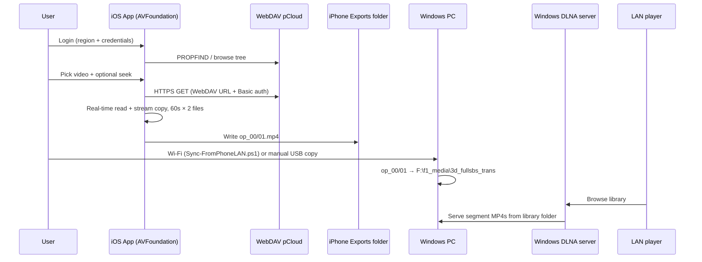

# iOS 3D Loop Segments — System Design

Greenfield design for an **iOS app** that logs into **pCloud**, browses media via **WebDAV**, exports **two rotating 60s MP4 segments** (AVFoundation, stream copy where possible), stores them where **Windows can read over USB**, and relies on the **existing Windows DLNA server** for LAN playback. **PC-side ffmpeg** (`Run-SegmentCopy.ps1` in the sibling `3d_loop_segments` repo) is **out of scope** for this project. **PotPlayer RememberFiles registry resume** is out of scope.

---

## Goals and non-goals

| In scope | Out of scope |
|----------|----------------|
| pCloud login + folder browser | PotPlayer `RememberFiles` / registry seek |
| WebDAV-backed media → **AVFoundation** export | **PC-side ffmpeg** / `Run-SegmentCopy.ps1` |
| Stream-copy segments: `op_00.mp4` / `op_01.mp4` | Re-encoding (unless required for a codec) |
| Seek resume in **app storage** (path or stable file id) | iOS DLNA server |
| Export folder visible in **Files** + USB to PC | PC Wi‑Fi DLNA idle kill (ffmpeg exit 125) |
| **Windows:** USB sync + existing DLNA server | Full pCloud sync client on PC |

---

## End-to-end flow



**Division of labor:** iPhone **produces** segments on **cellular** (pCloud WebDAV); **Wi‑Fi LAN sync** (or manual USB) copies to the PC; Windows **DLNA on WLAN** serves the library folder. **Personal Hotspot is not used** — the PC never routes through the phone for internet or streaming.

| Traffic | Path |
|---------|------|
| pCloud download / remux | iPhone → cellular (or Wi‑Fi if enabled) |
| Segment files to PC | Wi‑Fi LAN pull (`Sync-FromPhoneLAN.ps1`) or Apple Devices manual save |
| LAN playback | PC DLNA server → WLAN → TV |

See [WORKFLOW.md](WORKFLOW.md) for operator steps.

---

## Segment export contract (iPhone only)

Implemented with **AVFoundation** (`AVAssetReader` / `AVAssetWriter`), not embedded FFmpeg. Behavior matches the old Windows ffmpeg launcher conceptually:

| Behavior | Implementation |
|----------|------------------|
| Seek | `AVAssetReader.timeRange` from saved resume / presets (keyframe-aligned) |
| Real-time pacing | App throttles reads (replaces ffmpeg `-re`) |
| Stream copy | Passthrough when codec fits MP4 (H.264, HEVC, AV1 + AAC) |
| Segment length | 60s per file |
| File count | 2 files, overwrite: `op_00.mp4`, `op_01.mp4` |
| WebDAV auth | Custom `AVAssetResourceLoader` + `Authorization` header |

**Concurrency:** one active export job; reject or queue a second start with clear UI.

**Seek past end:** probe duration; skip if seek is past end (~0.25s margin).

**Quick seek UI:** presets `0 / 10 / 15 / 30 / 45` minutes (no PotPlayer registry).

**Stop conditions (iPhone):** user **Stop**, end of source, cancel — **no** intricate idle-timeout / DLNA Wi‑Fi heuristic on the phone (tabled).

---

## pCloud: login and WebDAV

### Regions

| Region | WebDAV base |
|--------|-------------|
| US | `https://webdav.pcloud.com` |
| EU | `https://ewebdav.pcloud.com` |

Credentials: **email + password** (Basic). **2FA:** WebDAV may require email confirmation per login; surface that in UI. Optional future: app-specific password / OAuth via REST only for token, still fetch bytes via WebDAV if required.

### Browse (WebDAV)

- `PROPFIND` depth 1 on folders; parse `DAV: href`, `DAV: displayname`, `DAV: getcontentlength`, `DAV: getcontenttype`, `DAV: resourcetype` (collection vs file).
- Filter listing to video extensions: `.mkv`, `.mp4`, `.avi`, `.mov`, `.m4v`, `.webm` (configurable).
- Cache folder metadata lightly; no full sync.

### Media URL for export

Build an **HTTPS GET URL** for `AVURLAsset` (custom resource loader):

```text
https://<host>/<url-encoded-path>
```

Pass credentials via **`Authorization: Basic`** in the resource loader (not in the URL). WebDAV should support **Range** for seek.

**Path encoding:** encode each path segment; preserve leading slash from WebDAV root (user’s pCloud root).

### Optional REST (phase 2)

pCloud REST (`api.pcloud.com` / `eapi.pcloud.com`) can improve login (`userinfo`, OAuth) and thumbnails; **playback/remux input stays WebDAV** unless you later switch to `getfilelink` direct CDN URLs for bandwidth.

---

## iOS app architecture

```text
┌─────────────────────────────────────────────────────────┐
│  SwiftUI shell                                          │
│  ├─ AuthView (region, email, password → Keychain)       │
│  ├─ BrowserView (WebDAV PROPFIND navigator)             │
│  ├─ ExportView (seek, presets, start/stop, progress)    │
│  └─ SettingsView (export dir, segment time, logs)       │
├─────────────────────────────────────────────────────────┤
│  Services                                               │
│  ├─ WebDAVClient (URLSession + XMLParser)               │
│  ├─ CredentialStore (Keychain)                          │
│  ├─ ResumeStore (UserDefaults / SwiftData)              │
│  ├─ ExportCoordinator (single job, BG task hooks)       │
│  └─ SegmentExporter (AVFoundation)                      │
├─────────────────────────────────────────────────────────┤
│  On-disk layout (app container)                         │
│  Documents/Exports/op_%02d.mp4   ← DLNA-facing names   │
│  Documents/Exports/logs/…  (same USB tree as segments)   │
│  Caches/…                                               │
└─────────────────────────────────────────────────────────┘
```

### Tech choices

| Layer | Choice |
|-------|--------|
| UI | SwiftUI (iOS 17+) |
| WebDAV | `URLSession` + lightweight PROPFIND parser (no heavy WebDAV framework required) |
| Export | AVFoundation (`AVAssetReader` / `AVAssetWriter`); no embedded ffmpeg on device |
| Secrets | Keychain (`kSecClassGenericPassword`) |
| Background | `BGProcessingTask` + `UIBackgroundTask` for long remux; declare `audio`/`processing` if needed; expect iOS to throttle |

### Export directory (USB-visible)

Use **App Documents** subfolder shared with Files and USB:

```text
Documents/Exports/
  op_00.mp4
  op_01.mp4
  export_state.json   # optional: last path, seek ms, job id
```

**Info.plist**

- `UIFileSharingEnabled` = YES (legacy iTunes File Sharing)
- `LSSupportsOpeningDocumentsInPlace` = YES
- `UISupportsDocumentBrowser` = YES (optional)

On Windows, when the device is trusted and unlocked:

```text
This PC → Apple iPhone → Files → <App Name> → Exports
```

(or equivalent path in Apple Devices / Explorer). **`Sync-FromPhoneLAN.ps1`** copies `op_00.mp4` into the PC DLNA pair, or the user saves manually via Apple Devices.

### Resume model (replaces PotPlayer)

```json
{
  "fileKey": "sha256(webdav_base + normalized_path)",
  "displayName": "movie.mkv",
  "lastSeekMs": 1234567,
  "updatedAt": "2026-05-16T12:00:00Z"
}
```

- Update `lastSeekMs` when user sets seek or when export stops (elapsed + start seek).
- **Do not** read Windows registry.
- On file pick: pre-fill seek from `ResumeStore`; show same quick presets as Windows script.

---

## Windows integration (DLNA + LAN)

### DLNA server

Keep existing setup: library root = `F:\f1_media\3d_fullsbs_trans` (or your production path). Media server indexes `op_00.mp4` and `op_01.mp4` as a **rolling buffer** of ~2 minutes from the current position.

**This repo’s Windows folder does not run ffmpeg.** Idle-stop / Wi‑Fi upload heuristics from the legacy `Run-SegmentCopy.ps1` pipeline are **not** part of this workflow.

### `Sync-FromPhoneLAN.ps1`

- Phone serves `Documents/Exports/op_00.mp4` on Wi‑Fi (port **8765**) while the app is open.
- PC script polls and copies to the older of `op_00.mp4` / `op_01.mp4` in the DLNA folder (atomic install, ffprobe check).
- Config: `Set-LoopSegmentsLANHost.ps1`, `Set-LoopSegmentsDestination.ps1`.

### LAN playback path

```text
[iOS export] → Wi‑Fi → [PC DLNA folder] → [Windows DLNA] → [TV / receiver / PotPlayer DLNA]
```

Manual fallback: Apple Devices → save `op_00.mp4` to the DLNA folder.

---

## Security and reliability

| Topic | Approach |
|-------|----------|
| Credentials | Keychain only; never log passwords |
| TLS | HTTPS WebDAV only |
| 2FA | Explain WebDAV email approval flow |
| Network | `-re` limits read rate; warn on cellular |
| Storage | ~2 × 60s of source bitrate; monitor free space |
| Errors | Surface export log tail in app (like legacy `segmentcopy_logs`) |
| Single job | Disable browse-to-export until job ends or user cancels |

---

## UI screens (minimal)

1. **Login** — region US/EU, email, password, test connection (`PROPFIND /`).
2. **Browser** — breadcrumbs, folders, video list with size/duration (`AVAsset` duration when available).
3. **Export** — current file, seek field, preset chips (0/10/15/30/45 min), **Start** / **Stop**, live log, output path hint (“Visible in Files → Exports”).
4. **History** — recent exports + saved seek per `fileKey`.

---

## Project layout (suggested)

```text
ios_3d_loop_segments/
  DESIGN.md                 # this file
  ios/
    LoopSegments/
      App/
      Features/Auth/
      Features/Browser/
      Features/Export/
      Services/WebDAV/
      Services/Export/
      Resources/Info.plist
  windows/
    Sync-FromPhoneLAN.ps1    # Wi‑Fi → PC DLNA pair
    Set-LoopSegmentsLANHost.ps1
    Set-LoopSegmentsDestination.ps1
    LoopSegments-Config.ps1
```

---

## Implementation phases

| Phase | Deliverable |
|-------|-------------|
| **1** | WebDAV login + folder browser + Keychain |
| **2** | AVFoundation export: WebDAV → `op_%02d.mp4`, stream copy, 60s × 2 |
| **3** | Export UI, resume store, single-job lock, logs |
| **4** | Files/USB visibility + `Sync-FromPhoneLAN.ps1` |
| **5** | Polish: duration probe, seek clamp, cellular warning, BG export |

Windows folder: **LAN sync** (`Sync-FromPhoneLAN.ps1`). No PC ffmpeg, no pCloud WebDAV on PC.

---

## Risks

| Risk | Mitigation |
|------|------------|
| iOS kills long export | BG tasks; user keeps app foreground for long runs; shorter test files first |
| WebDAV + seek slow | Keyframe-aligned seek; show “buffering” state |
| USB path varies by Windows version | Prefer LAN sync; document Apple Devices manual save path |
| 3D SBS huge files | Stream copy only; warn on cellular |
| 2FA blocks WebDAV | In-app instructions; app password if pCloud adds support |

---

## Legacy reference (out of scope)

The older **PC-only** pipeline (`P:\all_scripts\3d_loop_segments\Run-SegmentCopy.ps1`) used ffmpeg on Windows with MKV segment wrap. This project **does not** invoke that script; segment names and timing are kept compatible for the same DLNA folder layout, using **`.mp4`** on the phone.
