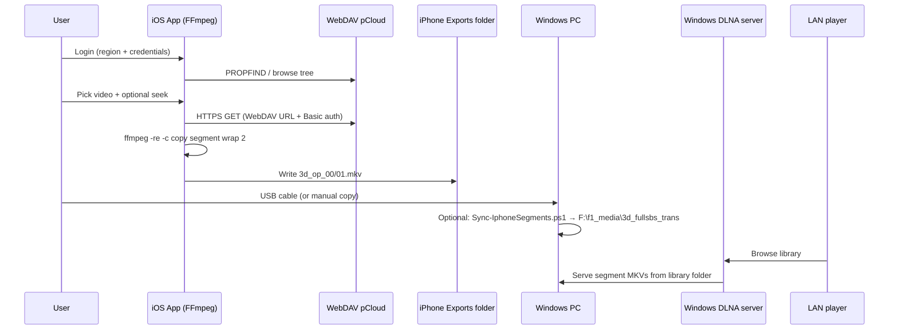

# iOS 3D Loop Segments — System Design

Greenfield design for an **iOS app** that logs into **pCloud**, browses media via **WebDAV**, remuxes with **FFmpeg** into **two rotating 60s MKV segments** (same contract as `Run-SegmentCopy.ps1`), stores them where **Windows can read over USB**, and relies on the **existing Windows DLNA server** for LAN playback. **PotPlayer RememberFiles registry resume is out of scope.**

---

## Goals and non-goals

| In scope | Out of scope |
|----------|----------------|
| pCloud login + folder browser | PotPlayer `RememberFiles` / registry seek |
| WebDAV-backed media URLs for FFmpeg input | Re-encoding (QSV, TargetMbps, scale) |
| Stream-copy segment mux: `3d_op_00.mkv` / `3d_op_01.mkv` | iOS DLNA server |
| Seek resume in **app storage** (path or stable file id) | Windows Wi-Fi idle monitor (stays on PC) |
| Export folder visible in **Files** + USB to PC | Full pCloud sync client |

---

## End-to-end flow



**Division of labor:** iPhone **produces** segments on **cellular** (pCloud WebDAV); **USB** copies files to the PC; Windows **DLNA on WLAN** serves the library folder. **Personal Hotspot is not used** — the PC never routes through the phone for internet or streaming.

| Traffic | Path |
|---------|------|
| pCloud download / remux | iPhone → cellular (or Wi‑Fi if enabled) |
| Segment files to PC | USB mass storage / Apple Devices file sharing |
| LAN playback | PC DLNA server → WLAN → TV |

See [WORKFLOW.md](WORKFLOW.md) for operator steps.

---

## FFmpeg segment contract (parity with `Run-SegmentCopy.ps1`)

Mirror the Windows launcher **without** deprecated encode knobs or registry resume.

```text
ffmpeg -hide_banner -y \
  -ss <seek_seconds> \
  -re \
  -i "<webdav_or_redirect_url>" \
  -map 0:v -map 0:a? \
  -c copy \
  -f segment \
  -segment_time 60 \
  -segment_wrap 2 \
  -reset_timestamps 1 \
  "<ExportDir>/3d_op_%02d.mkv"
```

| Parameter | Value | Notes |
|-----------|--------|--------|
| `-ss` | User / saved resume (seconds) | App `UserDefaults` or SwiftData keyed by **stable id** (see Resume) |
| `-re` | Always | Real-time read pacing; critical for cloud sources |
| `-c copy` | Always | No transcode; 3D SBS layout preserved in container |
| `-segment_time` | `60` | 60s segments |
| `-segment_wrap` | `2` | Exactly two files: `3d_op_00.mkv`, `3d_op_01.mkv` |
| Output pattern | `3d_op_%02d.mkv` | Same names as Windows for DLNA library compatibility |

**Concurrency:** one active export job (mutex equivalent to `Local\FfmpegSegmentCopy3dOpSegmentJobLock`). Queue or reject second start with a clear UI state.

**Seek past end:** optional ffprobe duration check; skip run if `seek > duration - 0.25s` (same as `-NoClampSeek` bypass on Windows).

**Quick seek UI (replaces 5s console prompt):** presets `0 / 10 / 15 / 30 / 45` minutes before start; does not use PotPlayer.

---

## pCloud: login and WebDAV

### Regions

| Region | WebDAV base |
|--------|-------------|
| US | `https://webdav.pcloud.com` |
| EU | `https://ewebdav.pcloud.com` |

Credentials: **email + password** (Basic). **2FA:** WebDAV may require email confirmation per login; surface that in UI. Optional future: app-specific password / OAuth via REST only for token, still fetch bytes via WebDAV if required.

### Browse (WebDAV)

- `PROPFIND` depth 1 on folders; parse `DAV: href`, `DAV: displayname`, `DAV: getcontentlength`, `DAV: getcontenttype`, `DAV: resourcetype` (collection vs file).
- Filter listing to video extensions: `.mkv`, `.mp4`, `.avi`, `.mov`, `.m4v`, `.webm` (configurable).
- Cache folder metadata lightly; no full sync.

### Media URL for FFmpeg

Build an **HTTPS GET URL** the demuxer can open:

```text
https://<host>/<url-encoded-path>
```

Pass credentials via **ffmpeg HTTP headers** (preferred over user:pass in URL):

```text
Authorization: Basic <base64(email:password)>
```

Use **ffmpeg-kit** (or successor) with `http_headers` / custom option string. Verify range requests work for `-ss` (WebDAV servers usually support `Range`).

**Path encoding:** encode each path segment; preserve leading slash from WebDAV root (user’s pCloud root).

### Optional REST (phase 2)

pCloud REST (`api.pcloud.com` / `eapi.pcloud.com`) can improve login (`userinfo`, OAuth) and thumbnails; **playback/remux input stays WebDAV** unless you later switch to `getfilelink` direct CDN URLs for bandwidth.

---

## iOS app architecture

```text
┌─────────────────────────────────────────────────────────┐
│  SwiftUI shell                                          │
│  ├─ AuthView (region, email, password → Keychain)       │
│  ├─ BrowserView (WebDAV PROPFIND navigator)             │
│  ├─ ExportView (seek, presets, start/stop, progress)    │
│  └─ SettingsView (export dir, segment time, logs)       │
├─────────────────────────────────────────────────────────┤
│  Services                                               │
│  ├─ WebDAVClient (URLSession + XMLParser)               │
│  ├─ CredentialStore (Keychain)                          │
│  ├─ ResumeStore (UserDefaults / SwiftData)              │
│  ├─ ExportCoordinator (single job, BG task hooks)       │
│  └─ FFmpegRunner (ffmpeg-kit wrapper)                   │
├─────────────────────────────────────────────────────────┤
│  On-disk layout (app container)                         │
│  Documents/Exports/3d_op_%02d.mkv   ← DLNA-facing names   │
│  Documents/Logs/…                                       │
│  Caches/…                                               │
└─────────────────────────────────────────────────────────┘
```

### Tech choices

| Layer | Choice |
|-------|--------|
| UI | SwiftUI (iOS 17+) |
| WebDAV | `URLSession` + lightweight PROPFIND parser (no heavy WebDAV framework required) |
| FFmpeg | [ffmpeg-kit](https://github.com/arthenica/ffmpeg-kit) full or min build with `segment` muxer |
| Secrets | Keychain (`kSecClassGenericPassword`) |
| Background | `BGProcessingTask` + `UIBackgroundTask` for long remux; declare `audio`/`processing` if needed; expect iOS to throttle |

### Export directory (USB-visible)

Use **App Documents** subfolder shared with Files and USB:

```text
Documents/Exports/
  3d_op_00.mkv
  3d_op_01.mkv
  export_state.json   # optional: last path, seek ms, job id
```

**Info.plist**

- `UIFileSharingEnabled` = YES (legacy iTunes File Sharing)
- `LSSupportsOpeningDocumentsInPlace` = YES
- `UISupportsDocumentBrowser` = YES (optional)

On Windows, when the device is trusted and unlocked:

```text
This PC → Apple iPhone → Files → <App Name> → Exports
```

(or equivalent path in Apple Devices / Explorer). User or a small **Windows sync script** copies `3d_op_*.mkv` into `F:\f1_media\3d_fullsbs_trans` for DLNA.

### Resume model (replaces PotPlayer)

```json
{
  "fileKey": "sha256(webdav_base + normalized_path)",
  "displayName": "movie.mkv",
  "lastSeekMs": 1234567,
  "updatedAt": "2026-05-16T12:00:00Z"
}
```

- Update `lastSeekMs` when user sets seek or when export stops (from ffmpeg progress / elapsed + start seek).
- **Do not** read Windows registry.
- On file pick: pre-fill seek from `ResumeStore`; show same quick presets as Windows script.

---

## Windows integration (DLNA + USB)

### DLNA server

Keep existing setup: library root = `F:\f1_media\3d_fullsbs_trans` (or your production path). Media server indexes `3d_op_00.mkv` and `3d_op_01.mkv` as a **rolling buffer** of ~2 minutes of content from the current position—same behavior as today.

**DLNA idle stop** (`Run-SegmentCopy.ps1` Wi-Fi five-window heuristic, exit 125): remains **Windows-only** while ffmpeg runs **on the PC**. When ffmpeg runs **on the phone**, idle detection is irrelevant on iOS; optionally add a **manual Stop** and **“mark idle”** on PC only if you later run a PC-side copy/ffmpeg again.

### Recommended helper: `Sync-IphoneSegments.ps1` (new, sibling repo)

- Trigger: scheduled task on USB connect, or manual.
- Source: `\\?\...\Apple iPhone\...\Exports\3d_op_*.mkv` (discover via Explorer shell / known relative path).
- Dest: `F:\f1_media\3d_fullsbs_trans` (overwrite in place).
- Optional: only copy if dest older than source (compare size/mtime).
- **Do not** copy PotPlayer registry; **do not** start PC ffmpeg unless you want a second pipeline.

### LAN playback path

```text
[iOS export] → USB → [PC folder] → [Windows DLNA] → [TV / receiver / PotPlayer DLNA]
```

Phone can be unplugged after copy. For **live** DLNA while exporting, PC must read from the iPhone mount directly (fragile: cable, unlock, trust); **copy-then-serve** is more reliable.

---

## Security and reliability

| Topic | Approach |
|-------|----------|
| Credentials | Keychain only; never log passwords |
| TLS | HTTPS WebDAV only |
| 2FA | Explain WebDAV email approval flow |
| Network | `-re` limits read rate; warn on cellular |
| Storage | ~2 × 60s of source bitrate; monitor free space |
| Errors | Surface ffmpeg stderr tail in app log view (like `segmentcopy_logs`) |
| Single job | Disable browse-to-export until job ends or user cancels |

---

## UI screens (minimal)

1. **Login** — region US/EU, email, password, test connection (`PROPFIND /`).
2. **Browser** — breadcrumbs, folders, video list with size/duration (duration via ffprobe on HEAD/range or small probe file).
3. **Export** — current file, seek field, preset chips (0/10/15/30/45 min), **Start** / **Stop**, live log, output path hint (“Visible in Files → Exports”).
4. **History** — recent exports + saved seek per `fileKey`.

---

## Project layout (suggested)

```text
ios_3d_loop_segments/
  DESIGN.md                 # this file
  ios/
    LoopSegments/
      App/
      Features/Auth/
      Features/Browser/
      Features/Export/
      Services/WebDAV/
      Services/FFmpeg/
      Resources/Info.plist
  windows/
    Sync-IphoneSegments.ps1 # optional USB → F:\f1_media\3d_fullsbs_trans
```

---

## Implementation phases

| Phase | Deliverable |
|-------|-------------|
| **1** | WebDAV login + folder browser + Keychain |
| **2** | ffmpeg-kit proof: WebDAV URL → local `3d_op_%02d.mkv` with exact args |
| **3** | Export UI, resume store, single-job lock, logs |
| **4** | Files/USB visibility + `Sync-IphoneSegments.ps1` |
| **5** | Polish: ffprobe duration, seek clamp, cellular warning, BG export |

Windows folder contains **USB sync only** (`Sync-IphoneSegments.ps1`, `Register-UsbSyncTask.ps1`). No PC-side pCloud WebDAV launcher.

---

## Risks

| Risk | Mitigation |
|------|------------|
| iOS kills long ffmpeg | BG tasks; user keeps app foreground for long runs; shorter test files first |
| WebDAV + `-ss` slow | Prefer seek within supported range; show “buffering” state |
| USB path varies by Windows version | Document path; sync script searches `Exports` under app name |
| 3D SBS huge files | Stream copy only; warn on cellular |
| 2FA blocks WebDAV | In-app instructions; app password if pCloud adds support |

---

## Reference

Windows segment launcher: `P:\all_scripts\3d_loop_segments\Run-SegmentCopy.ps1`  
Core ffmpeg argument block: lines 719–731 (`-ss`, `-re`, `-c copy`, `-f segment`, `-segment_time 60`, `-segment_wrap 2`, `3d_op_%02d.mkv`).
