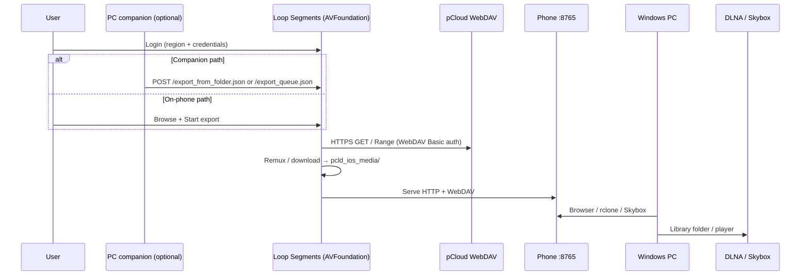

# Loop Segments — System Design

Current architecture for the **Loop Segments** iPhone app and Windows companion tools in this repo.

**Division of labor:** the phone pulls from **pCloud over cellular** (WebDAV), writes segments / working media under private app storage, and serves them on **Wi‑Fi LAN `:8765`**. The PC browses/mounts that LAN endpoint (or uses the Chromium companion to queue exports). Windows **DLNA** (or Quest Skybox) plays from the PC/library — the phone is **not** a DLNA server.

Operator steps: [WORKFLOW.md](WORKFLOW.md) · iOS detail: [ios/README.md](ios/README.md) · PC tools: [windows/README.md](windows/README.md).

---

## Goals and non-goals

| In scope (this repo) | Out of scope |
|----------------------|--------------|
| pCloud login + WebDAV browse / search | PotPlayer `RememberFiles` / Windows registry seek |
| AVFoundation export (stream copy when possible) | **PC-side ffmpeg** / sibling `3d_loop_segments\Run-SegmentCopy.ps1` |
| Rotating `op_00` / `op_01` when Mbps + codec allow | Embedded ffmpeg on iOS (broken on iOS 26) |
| Sparse `_working.mp4`, vanilla download, optional HLS | iOS DLNA server |
| LAN HTTP + WebDAV on `:8765` | Full pCloud sync client on the PC |
| Pending FIFO + Paused checkpoints | Apple Devices USB automation |
| Keep Alive (silent audio) so export / LAN survive lock | Server WebDAV `COPY` (MOVE is supported) |
| Windows companion, USB launch, optional rclone mount | |

---

## End-to-end flow


```mermaid
sequenceDiagram
    participant User
    participant Comp as PC companion (optional)
    participant iOS as Loop Segments (AVFoundation)
    participant PC as pCloud WebDAV
    participant LAN as Phone :8765
    participant Win as Windows PC
    participant DLNA as DLNA / Skybox

    User->>iOS: Login (region + credentials)
    alt Companion path
        Comp->>iOS: POST /export_from_folder.json or /export_queue.json
    else On-phone path
        User->>iOS: Browse + Start export
    end
    iOS->>PC: HTTPS GET / Range (WebDAV Basic auth)
    iOS->>iOS: Remux / download → pcld_ios_media/
    iOS->>LAN: Serve HTTP + WebDAV
    Win->>LAN: Browser / rclone / Skybox
    Win->>DLNA: Library folder / player
```

| Traffic | Path |
|---------|------|
| pCloud download / remux | iPhone → **cellular** (Wi‑Fi off OK) |
| Segment / working files to PC | iPhone → PC over **Wi‑Fi** (`:8765`) |
| LAN playback | PC DLNA / Skybox → WLAN → TV / headset |

**No Personal Hotspot** required — the PC does not route internet through the phone.

---

## Segment / export contract (iPhone)

Implemented with **AVFoundation** (`AVAssetReader` / `AVAssetWriter` / export session), not embedded FFmpeg.

| Behavior | Implementation |
|----------|----------------|
| Seek | Keyframe-aligned from resume / presets (`0 / 10 / 15 / 30 / 45` min) |
| Real-time pacing | App throttles reads (ffmpeg `-re` analogue) |
| Stream copy | H.264 / HEVC (hvc1/hev1) + AAC when source allows |
| Mbps gate | Below cutoff (default **35** Mbps): full-file / preload only — **no** `op_*.mp4`. At/above + codec OK: ~60s segments |
| Segments | Alternate `pcld_ios_media/loop/op_00.mp4` ↔ `op_01.mp4` |
| Working copy | Sparse `_working.mp4` (+ map); vanilla `_vanilla_download.*`; optional HLS `_working_pcloud_transcode.mp4` |
| AV1 | **Not supported** — prefer H.265 |
| Containers | WMV / MKV / WebM / TS → vanilla (and optional HLS); no device segments |
| Concurrency | One live export; new Start / FIFO `startFirst` **soft-pauses** the live run into **Paused** |
| Stop | Clears pause state; removes `op_*.mp4`; archives root media as needed |

**Recovery order (typical):** vanilla WebDAV download (default on) → sparse `_working` → HLS `gethlslink` if bitrate high enough **and** REST token present.

---

## pCloud: WebDAV vs REST

### Regions

| Region | WebDAV | REST API |
|--------|--------|----------|
| US | `https://webdav.pcloud.com` | `https://api.pcloud.com` |
| EU | `https://ewebdav.pcloud.com` | `https://eapi.pcloud.com` |

Credentials: **email + password** (WebDAV Basic). Optional REST token for search / HLS.

| Use | WebDAV | REST |
|-----|--------|------|
| Browse (PROPFIND), Range GET, vanilla download, sparse export | **Primary** | — |
| Filename walk / bookmarks search | Fallback | Optional Browse toggle |
| HLS `gethlslink` | — | **Required** (often unavailable → vanilla-only) |

---

## iOS app architecture

```text
┌──────────────────────────────────────────────────────────────┐
│  SwiftUI                                                     │
│  ├─ AuthView          region + credentials → Keychain        │
│  ├─ BrowserView       WebDAV navigate / search / bookmarks   │
│  ├─ ExportView        seek, Start/Pause/Stop, LAN, Keep Alive│
│  ├─ QueuedExportsView pending FIFO                          │
│  └─ PausedExportsView checkpoints                           │
├──────────────────────────────────────────────────────────────┤
│  AppSession / RootView                                       │
│  credentials, tab shell, export lifecycle, LAN while up      │
├──────────────────────────────────────────────────────────────┤
│  Services                                                    │
│  ├─ WebDAV*           client, PROPFIND, resource loader      │
│  ├─ PCloud*           optional REST auth / search / HLS      │
│  ├─ ExportCoordinator single job; handoff / archive / park   │
│  ├─ SegmentExporter   AVFoundation passthrough / dense fill  │
│  ├─ PendingExportQueue  scripts/export_pending_queue.json    │
│  ├─ ExportLANServer   :8765 HTTP + WebDAV + REST triggers    │
│  ├─ ResumeStore       seek checkpoints (Paused cap 10)       │
│  └─ Keep Alive        silent MP3 (default on, 60 min sessions)│
├──────────────────────────────────────────────────────────────┤
│  On disk (Application Support — not Files / USB)             │
│  Library/Application Support/pcld_ios_media/                 │
└──────────────────────────────────────────────────────────────┘
```

### Tech choices

| Layer | Choice |
|-------|--------|
| UI | SwiftUI (iOS 17+) |
| WebDAV | `URLSession` + PROPFIND parser; Basic auth on `AVURLAsset` via resource loader |
| Export | AVFoundation only |
| Secrets | Keychain |
| Background | Keep Alive audio session + `UIBackgroundTask` / BG hooks; Low Power Mode unreliable |
| Icon | `Assets.xcassets/AppIcon` (1024×1024 dual-segment loop) |

### On-disk layout (`pcld_ios_media/`)

Served on LAN as `/pcld_ios_media/...`. Legacy `Documents/Exports/` is empty after migration (safe to delete in Files).

| Path | Role |
|------|------|
| `loop/op_00.mp4`, `loop/op_01.mp4` | Rotating ~60s segments |
| `_working.mp4` + `_working.sparse.json` | Sparse full-timeline mirror |
| `_vanilla_download.<ext>` | Full WebDAV download (legacy `_vanilla_faststart.mp4` may still exist) |
| `_working_pcloud_transcode.mp4` | Progressive HLS remux (REST token) |
| `parked/<filename>/` + `_parked_meta.json` | Soft-pause / handoff partials (LAN-playable) |
| `archive/` | Finished / handed-off root media (PC `.ps1` helpers may live here) |
| `downloads/` | LAN “export from URL” saves |
| `logs/` | Live + history export logs |
| `scripts/` | Triggers, ack, pending FIFO JSON, small PC PUTs |

**WebDAV write policy:** pipeline slots (`loop/`, `parked/`, `_working*`, `_vanilla_*`, `logs/`) are read-only to clients. Writable: `scripts/`, `archive/` (non-pipeline), nested PUTs ≤ **2 MB**. **MOVE** supported (build 282+); no server **COPY**.

### Queues and pause

| Store | Cap | Behavior |
|-------|-----|----------|
| Pending FIFO (`export_pending_queue.json`) | **50** | Companion / REST enqueue; drain on finish / Stop; **user Pause holds** drain; drain waits while a LAN start is still resolving; **Move to queued** appends paused here as fresh jobs (skips **Unavailable** rows) |
| Paused (`ResumeStore` / parked) | **10** `exportInProgress` | Soft-pause keeps checkpoint; FIFO does **not** auto-resume interrupted live runs; folder miss → **Unavailable** (Copy name / Search in Browse; no Resume); **Move to queued** / `queue_all` drops checkpoints + parks for available rows only |

### Keep Alive

Default **on**. Loops bundled `KeepAlive_silence.mp3` so export + LAN + trigger polling can continue under lock. **Mix** (default) or **Prefer lock screen controls**. Foreground / post-export sessions ~**60 minutes**. See [ios/README.md](ios/README.md).

---

## LAN API (`:8765`)

Basic auth for WebDAV and sensitive JSON: **`admin` / `iosadmin`** (same as Quest Skybox). Media GET often unauthenticated for PC sync convenience.

| Endpoint | Role |
|----------|------|
| `GET /`, `GET /browse` | Monitor / full browse UI (+ PROPFIND for WebDAV clients on `/`) |
| `GET /status.json` | Live export + pending queue summary |
| `PUT`/`POST /export_from_folder.json` | Queue by `folderPath` + `displayName` (or filename-only walk) → **202** |
| `PUT`/`POST /export_queue.json` | Pending FIFO (`append` / `prepend` / `replace`, `startFirst`, remove/clear) |
| `PUT`/`POST /export_from_url.json` | Queue HTTPS download export |
| `GET`/`POST /paused_exports.json` | List / clear paused / `queue_all` (move paused → Queued) |
| `…/scripts/export_trigger.json` (+ `.ack.json`) | Imperative commands + last ack |
| `GET /pcloud_list.json`, `/pcloud_bookmarks.json` | Phone-side pCloud listing / bookmarks (auth) |
| Legacy | `/export_latest.txt`, `/export_progress.txt`, `/logs/…`, `/loop_segments_ok.txt` |

Prefer **`/export_from_folder.json`** over CDN `getfilelink` URLs (CDN is IP-bound → often **HTTP 410** on the phone).

---

## Windows integration

Day-to-day: **companion** (queue exports) + optional **rclone** mount + **USB** launch/Home. Config: gitignored `windows/loop-segments-windows.json`.

| Folder | Role |
|--------|------|
| `setup/` | One-time PC bootstrap, LAN IP, per-PC json |
| `pcloud_web_companion/` | Chromium MV3; multi-select Download → phone FIFO; USB-foreground; optional rclone |
| `usb/` | `pymobiledevice3` Launch / Home |
| `rclone/` | Optional WinFsp drive letter over phone WebDAV |
| `sideload/` | AltServer at logon; Sideloadly fallback |
| `lan/` | Multi-phone listing / PC index `:8766` |
| `lib/` | Shared helpers (AltServer wrappers → `env_setup` submodule, Python picker, settings) |
| `archive/` | Legacy `Sync-FromPhoneLAN.ps1`, `net use`, old mounts |

Repo-root submodule **`env_setup/`** ([ios_env_setup](https://github.com/dsouzaankit/ios_env_setup)): AltServer start and phone-subnet refresh. Repo-root **`Skybox_vr_pc/`** ([skybox-vr-pc](https://github.com/dsouzaankit/skybox-vr-pc)): SKYBOX desktop process + AirScreen Add-folders. Clone with `--recurse-submodules`.

**Typical sequence**

```powershell
cd <repo>\windows
.\setup\Setup-LoopSegmentsWindows.ps1 -PhoneHost <phone-ip>
.\sideload\Register-AltServerAtLogon.ps1   # optional
.\pcloud_web_companion\Run-PCloudWebCompanion.ps1
```

Companion ensures **AltServer** is running when installed, USB-launches Loop Segments (locked phone → abort Chromium), then browses my.pcloud.com while the **phone** does cellular WebDAV.

PC DLNA library path (e.g. `F:\f1_media\3d_fullsbs_trans`) is **your** media server — this repo does not run ffmpeg into it.

---

## Build and deploy (no local Mac)

| Piece | Role |
|-------|------|
| `ios/project.yml` | XcodeGen → `LoopSegments.xcodeproj` (iOS 17+, `com.loopsegments.app`) |
| `.github/workflows/ios-build.yml` | Simulator smoke on push; **workflow_dispatch** IPA artifact |
| `deploy.ps1` | Trigger/watch Actions → download IPA → `copy-to-icloud.ps1` |
| `copy-to-icloud.ps1` | Stamp `LoopSegments-b{build}-{time}.ipa` into iCloud Downloads; prune older |
| Install | AltStore **My Apps → +** on the phone (primary); ~7-day free cert refresh via AltServer |

---

## Project layout

```text
ios_3d_loop_segments/
  DESIGN.md                 # this file
  WORKFLOW.md
  deploy.ps1 / copy-to-icloud.ps1
  ios/
    project.yml             # XcodeGen
    LoopSegments/
      App/                  # LoopSegmentsApp, AppSession, RootView
      Features/{Auth,Browser,Export,Paused,Shared}/
      Services/{WebDAV,PCloud,Export}/…
      Models/
      Assets.xcassets/AppIcon.appiconset/
      Resources/            # Info.plist, KeepAlive_silence.mp3, PrivacyInfo
  windows/
    setup/ usb/ rclone/ sideload/ lan/ lib/
    pcloud_web_companion/
    archive/                # legacy sync scripts
  env_setup/                # submodule ios_env_setup (AltServer start / phone subnet)
  Skybox_vr_pc/             # submodule skybox-vr-pc (SKYBOX desktop + AirScreen share)
```

---

## Security and reliability

| Topic | Approach |
|-------|----------|
| Credentials | Keychain; never log passwords |
| TLS | HTTPS WebDAV / REST only for pCloud |
| LAN | Basic auth on WebDAV + sensitive JSON; private Wi‑Fi assumed |
| Cellular | Warn / pace reads; dense fill per minute when segmenting |
| Storage | Rotating ~2×60s segments + working/vanilla; Clear media / archive prune |
| Single job | Soft-pause handoff instead of hard-kill when starting another |
| Sideload | AltStore refresh weekly; Trust developer after install |

---

## UI surfaces

1. **Login** — US/EU, email, password, Keychain.
2. **Browse** — WebDAV tree, search, bookmarks; pin latest finished export; orange **Exporting** bar while busy.
3. **Export** — seek presets, Start / Pause / Stop, Mbps cutoff, LAN toggle, Keep Alive, logs / clear media.
4. **Queued** — pending FIFO; Clear / Remove.
5. **Paused** — checkpoints; **Unavailable** (moved/missing source) with Copy name / Search in Browse; Move to queued / Resume / Clear.
6. **LAN `/` + `/browse`** — same queues + playback links for the PC browser.

---

## Risks

| Risk | Mitigation |
|------|------------|
| iOS suspends long export | Keep Alive on; avoid Low Power Mode; optional Auto-Lock → Never |
| WebDAV seek / moov-at-end HEVC slow | Dense fill + vanilla/HLS fallbacks; show progress in `export_latest.txt` |
| CDN URLs expire on phone | Companion uses folder+name REST, not `getfilelink` |
| Free AltStore cert (~7 days) | AltServer + USB **Refresh All**; companion auto-starts AltServer |
| Icon blank after upgrade | Delete old app before installing new IPA (iOS caches blank icons) |

---

## Legacy reference (out of scope)

The older **PC-only** pipeline (`P:\all_scripts\3d_loop_segments\Run-SegmentCopy.ps1`) uses ffmpeg on Windows. This project does **not** invoke it. Segment names (`op_00` / `op_01`) stay compatible with the same DLNA folder layout; production on the phone uses **`.mp4`** under `pcld_ios_media/`.
