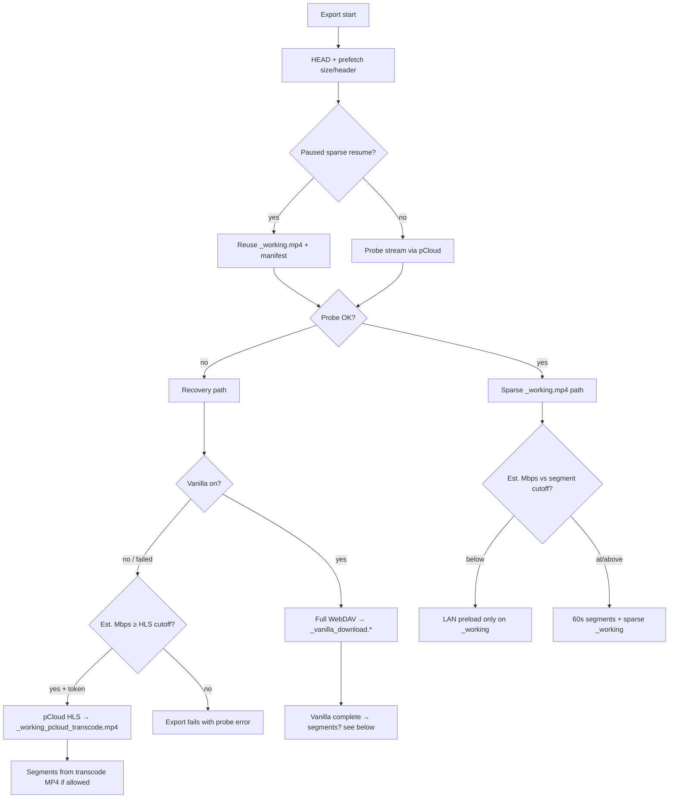

https://github.com/dsouzaankit/ios_3d_loop_segments/actions/workflows/ios-build.yml

cd P:\all_scripts\ios_3d_loop_segments\windows
Copy-Item loop-segments-windows.example.json loop-segments-windows.json   # once per PC
.\Set-LoopSegmentsWindows.ps1 -PhoneHost 10.0.100.10
.\Mount-LoopSegmentsRclone.ps1 -TestOnly   # optional LAN probe; rclone mount: see ../windows/RCLONE-PHONE-MOUNT.md
# Skybox (Quest): Add WebDAV → http://<phone-ip>:8765/ (IP from Export screen) · admin / iosadmin — see “Quest LAN playback” below

Notes:
LAN: below Mbps cutoff → preload/full file only; at/above → op_*.mp4 when codec allows (LAN server optional).
_working.mp4: full-timeline LAN play is reliable at seek=0:00; seek>0 see “Seek > 0” below.
Av1 is not supported, prefer h.265!
phone: foreground recommended, or enable **Keep Alive** on Export (silent lock-screen audio; see **Background / lock screen** below):
  Optional: Settings > Display & Brightness > Auto-Lock > Never!


# Loop Segments (iOS)

**Cellular → pCloud WebDAV → segment export → LAN (or USB) → PC DLNA.** See [../WORKFLOW.md](../WORKFLOW.md).

Build **1.0.6+** uses **AVFoundation** stream copy to `op_00.mp4` / `op_01.mp4` (no embedded ffmpeg). Required on **iOS 26.x** (ffmpeg-kit crashes at launch).

## Open in Xcode (requires macOS or cloud CI)

**Option A — XcodeGen**

```bash
cd ios
brew install xcodegen   # on macOS
xcodegen generate
open LoopSegments.xcodeproj
```

No ffmpeg SPM dependency in [project.yml](project.yml).

**Option B — manual**

1. New iOS App (SwiftUI, iOS 17+).
2. Add all files under `LoopSegments/`.
3. Merge [LoopSegments/Resources/Info.plist](LoopSegments/Resources/Info.plist) keys.

## Export (AVFoundation)

- WebDAV: `WebDAVResourceLoader` + Basic auth on `AVURLAsset`
- Passthrough to MP4 when supported: H.264, HEVC (hvc1/hev1) + **AAC audio** when the source has aac/mp4a (manual path was video-only before build 133; export session kept both tracks)
- 60s segments when source is **at/above** the Mbps cutoff (and codec allows); phone alternates **`pcld_ios_media/loop/op_00.mp4`** / **`pcld_ios_media/loop/op_01.mp4`**; sparse in-progress copy **`pcld_ios_media/_working.mp4`**. Below cutoff: LAN preload to EOF only (no segments). **LAN:** **`http://<phone-ip>:8765/`** serves **HTTP** (files, index, Range) **and WebDAV** (PROPFIND / listings for Skybox, Windows clients). **Quest Skybox:** add **WebDAV** with **`admin` / `iosadmin`**. **PC:** browser / `Invoke-WebRequest` / **[`../windows/archive/Sync-FromPhoneLAN.ps1`](../windows/archive/Sync-FromPhoneLAN.ps1)**; optional **[`rclone`](../windows/RCLONE-PHONE-MOUNT.md)** mount to a drive letter can feel **sluggish** — not required if Skybox talks to the phone directly. **Dense fill** per minute when segments run.

### On-disk layout (Files app vs LAN)

| Location on phone | Visible in **Files** / **USB** | Served on **LAN :8765** |
|-------------------|--------------------------------|-------------------------|
| **`Documents/Exports/`** | Empty after upgrade (safe to delete in Files) | — |
| **`Library/Application Support/pcld_ios_media/`** — media, **`logs/`** (export logs + `loop_segments_ok.txt` probe) | **No** (sandbox) | Yes as **`/pcld_ios_media/...`** (legacy **`/export_latest.txt`**, **`/logs/export_*.txt`**, **`/loop_segments_ok.txt`**) |

### Export logs (live vs history)

| File | Purpose |
|------|---------|
| **`pcld_ios_media/logs/export_latest.txt`** | **Current run only** — full live log (LAN). Cleared when the next export starts. |
| **`pcld_ios_media/logs/export_progress.txt`** | Last ~12 lines of the current run (small file for PC polling). |
| **`pcld_ios_media/logs/export_<basename>_<local-time>_<status>.txt`** | **Saved history** when a run ends (`completed`, `interrupted`, `paused`, …). Kept across exports (last **40** runs; oldest pruned). |
| **`pcld_ios_media/logs/loop_segments_ok.txt`** | Launch probe (app version + timestamp); refreshed each launch. |

On disk under **Application Support** (not in the Files app). LAN also accepts legacy URLs **`/export_latest.txt`**, **`/export_progress.txt`**, and **`/logs/export_…txt`** (same files).

While a run is active there are **two** live copies (`export_latest.txt` + a temporary `export_<unix>.txt` in the same folder); when the run finishes the unix copy is **renamed** to the descriptive name above. There is **no** `.log` duplicate (legacy `export_latest.log` / `export_session_*` are removed on upgrade). After **pause** (including **2h auto-pause**), the LAN log list hides duplicate `*_paused.txt` rows that match `export_latest.txt` byte-for-byte.

**Start export** archives any finished live log, clears live pointers, and **keeps** history. **Resume** after pause keeps history and on-disk media (no log wipe); checkpoint seek is used even if the Export screen seek UI drifted. **Clear logs** (Export tab) deletes all log files. Copy from LAN **`http://<ip>:8765/pcld_ios_media/logs/…`** (or legacy **`/export_latest.txt`**). On upgrade, logs move automatically out of **Documents/Exports/**.

On first launch after upgrade, existing **`Documents/Exports/pcld_ios_media/`** is moved into Application Support automatically. **rclone** and **WebDAV** paths are unchanged (`L:\pcld_ios_media\...`). Copy **segment MP4s** from the PC via LAN/rclone, not Apple Devices USB.
- **Recovery when sparse probe fails:** probes **via pCloud before** creating `_working.mp4` when not resuming a paused sparse export; abandons any stale sparse shell when vanilla/HLS starts; LAN hides `_working.mp4` while `_vanilla_download.*` is active. **WMV/MKV/WebM/TS/etc.** skip sparse probe entirely (**HEAD + vanilla fast path**). (1) **Vanilla WebDAV download** first if enabled (default on; **no API token** — works when `gethlslink` fails) → **`_vanilla_download.<ext>`**; MP4/MOV/M4V also **`_vanilla_faststart.mp4`**; (2) **pCloud HLS** only if vanilla is off or failed and estimated bitrate is above the **HLS cutoff** → **`_working_pcloud_transcode.mp4`** (**needs REST token** — see limitation section). Browser shows **WMV** and **TS** in the file list.
- Real-time read pacing (like ffmpeg `-re`); segments cut at **keyframes** (~60s target, not strict wall-clock grid)
- Runs until end of file, **Pause** (checkpoint + files kept), or **Stop** (clears paused state, removes `op_*.mp4`); **per-minute failsafe** skips a failed minute and continues dense-filling **`_working.mp4`**
- **In-app while exporting:** orange **Exporting** bar pinned at the top of **Browse** and **Export** (export keeps running if you leave Export); row badge **Exporting** on the active file. **Paused exports** sidebar hides the file that is actively exporting.
- **Keep Alive (optional):** Export tab → **Keep Alive** (above **Exports folder**) → **Keep Alive (lock screen)**. Loops **`KeepAlive_silence.mp3`** from [anars/blank-audio](https://github.com/anars/blank-audio) (see **`KeepAlive_silence-credits.txt`**). **Build 190+:** MP3 in the app bundle (CI verifies IPA). **Build 187+:** background-task renewal + silence-loop watchdog. **Build 193+:** lock-screen Play/Pause logging, minimal Now Playing text (no pCloud filename), reclaim card after another app stops. See **Keep Alive: mix vs lock screen** and **Background / lock screen** below. Not reliable in Low Power Mode.
  - **LAN auth note:** The pCloud LAN proxy endpoints **`/pcloud_list.json`** and **`/pcloud_bookmarks.json`** now require the same Basic auth as WebDAV (**`admin` / `iosadmin`**), since they expose pCloud folder/file names.

### Keep Alive: mix vs lock screen

Both modes run the **same silent MP3 loop in the background** during export. The toggle only changes how the app shares iOS audio / Now Playing with other apps (e.g. Evermusic).

| Setting | Audio session | Lock screen / Control Center | Other music apps (Evermusic) |
|---------|---------------|------------------------------|------------------------------|
| **Keep Alive on**, **Prefer lock screen controls** **off** (**mix mode**, default) | `.playback` + **mix with others** | Usually **no** Keep Alive card; Play/Pause may **not** control our loop | Can play **alongside** export; long playlists can **pause** our loop and risk iOS suspending export/LAN |
| **Prefer lock screen controls** **on** | `.playback` **exclusive** | **Keep Alive** card; Play/Pause should stop/start the silence loop | May **stop or duck** other audio; better for unattended locked export |

**Mix mode is not “background only.”** It means “keep export alive **without** taking the lock screen from other apps.” After another app **stops** playing, **build 193+** tries to **resume the loop** and **reclaim** the Keep Alive card once (`Keep Alive: reclaimed lock screen Now Playing` in **`export_latest.txt`**).

**Long Evermusic (or any music) during export:** if our loop stays interrupted, iOS may no longer treat Loop Segments as a background **audio** app → export can **interrupt** and **LAN** can drop after ~15–30+ minutes. For long locked exports, avoid long other-app playback, or use **Prefer lock screen controls** (and accept that other music may not run).

**Lock screen Now Playing text:** **Title** `Keep Alive`, **Artist** `Loop Segments`, short subtitle (`Export running` / `Paused`) — not the pCloud file name.

**Remote control logs in `export_latest.txt`:** `pause from lock screen — loop stopped`, `play — already looping`, `play from lock screen`, `resuming after interruption`, `reclaimed lock screen Now Playing`.

### Background / lock screen (iOS limits)

**Do not confuse “export finished” with “iOS killed the app.”** When export **reaches end of file** (or finishes the run), the app calls **`endExportSession()`** — **Keep Alive audio stops on purpose**, the orange **Exporting** bar goes away, and finished root media is moved under **`pcld_ios_media/archive/`**. A run of **~34 minutes** that **plays fully from archive** on LAN is consistent with **success**, not background preemption.

**How to tell in `export_latest.txt`:**

| Log / status | Meaning |
|--------------|---------|
| **`completed (end of file)`** / **Reached end of file** | Normal finish — audio stopping afterward is expected. |
| **`Export interrupted`** / status **`interrupted`** | Reader cancelled mid-run (Wi‑Fi drop, app killed, etc.) — resume with **Start export**. |
| **`Auto-pause: … reached`** | In-app cap (Export → **Auto-pause**, default **2 hours**; options 3–150 min). |
| **`Keep Alive: failed`** / missing MP3 | Bundling bug (fixed **build 190+**), not iOS. |
| **`Keep Alive: pause from lock screen`** | Lock-screen Pause reached the app; loop should stop. |
| **`Keep Alive: play — already looping`** | Lock-screen Play while loop already running (normal). |
| **`Keep Alive: resuming after interruption`** | Another app released audio; loop retrying. |
| **`Keep Alive: reclaimed lock screen Now Playing`** | Mix mode: card shown again after other app stopped. |

**Locked-screen risk (still real, but unproven at exactly ~30 min):** iOS *can* suspend apps that are not playing background audio. Early tests *looked* like a ~30 min cutoff when Keep Alive was broken (MP3 not in the bundle) or logs were read as **interrupted** without checking archive playback. Treat **~30 min** as a rough watchpoint, not a confirmed iOS timer.

| Mechanism | What it does | Multi-hour locked export? |
|-----------|----------------|---------------------------|
| **`beginBackgroundTask` / renewal** (`BackgroundTaskKeeper`) | Short grace when the app moves to background (~**tens of seconds** per task; Apple discourages chaining). Used so export can finish a slice of work after lock, **not** to extend runtime by 30+ minutes. | **No** — do not rely on this past a brief transition. |
| **`UIBackgroundModes` → `audio`** + **Keep Alive** | While the app is **actually playing audio** (muted silence loop) with an active **playback** audio session, iOS treats the app like a music player and may keep it running **much longer** than an idle background app. | **Best effort** — this is the intended path for lock-screen export; still not a guarantee (Low Power Mode, memory pressure, audio interrupted by another app, system kill). |
| **Export auto-pause** (in-app) | Deliberate cap: pauses at checkpoint after the chosen duration (default **2 h**; Export screen picker: 3, 5, 15, 30, 60, 90, 120, 150 min). Log: **`Auto-pause: … reached`** in **`export_latest.txt`**. | N/A (by design). |

**There is no API to request “another 30 minutes” of generic background time.** iOS does not grant stacked 30-minute extensions via `beginBackgroundTask`. Long runs depend on **Keep Alive audio** (and stable Wi‑Fi for WebDAV reads), not on background-task renewal.

**Practical guidance:** enable **Keep Alive**; use **build 190+** so **`KeepAlive_silence.mp3`** is in the IPA; stay on **Wi‑Fi**; avoid **Low Power Mode**. After a long locked run, confirm **`completed (end of file)`** and archive playback before assuming iOS preemption. If truly interrupted, **Start export** resumes from the checkpoint.

Implementation: `LoopSegments/Services/Export/SegmentExporter.swift`

## PC sync (LAN — HTTP + WebDAV)

1. On the phone: **LAN server on Wi‑Fi** (export screen; app open on LAN). **Switch file:** **Export random file** / **Choose file…** (Export tab → **Export another file**, above **Exports folder**) — picks another pCloud video at **0:00** from **this folder** (parent of current file) or **bookmarked folders**; starts a **new** export (not an in-run playlist).
2. **URLs:** **`http://<phone-ip>:8765/`** — **light monitor** (playback, logs, pause/stop; **manual refresh only**). **`http://<phone-ip>:8765/browse`** — full page with pCloud folder browser (auto-refresh **60 s** / **120 s** when idle). Also **`status.json`**, **`status_lists.json`**, **GET**/**HEAD** with **Range**, plus **WebDAV** (PROPFIND, PUT/MKCOL for scripts under `pcld_ios_media/`, LOCK, etc.). Use monitor **`/`** during large exports; open **`/browse`** only when you need LAN export-from-folder. Direct **`/export_latest.txt`** is always safe. mDNS: **`http://<iphone-name>.local:8765/`** (Bonjour **`loopsegments._http._tcp`**).
3. **Skybox on Quest:** WebDAV root above, Basic auth **`admin` / `iosadmin`** (same as in code). **PC DLNA:** usually copy or sync into a local folder; mounting the phone with **`rclone`** is **optional** and often **slow** vs playing from Skybox or using direct HTTP links — see [`../windows/RCLONE-PHONE-MOUNT.md`](../windows/RCLONE-PHONE-MOUNT.md).

Unattended **pCloud → PC** (no phone LAN): **`Run-SegmentCopy.ps1`** in the sibling **`3d_loop_segments`** repo.

LAN serves **`pcld_ios_media/**`** automatically (all video extensions on disk — `op_*.mp4`, `_working*.mp4`, `_vanilla_*`, faststart copies, WMV/MKV, etc.). **Excluded:** `*.staging.*`, `*.sparse.json`, hidden/temp remux files. **`_vanilla_download.<ext>`** is listed and served **while the WebDAV download runs** (growing file); MP4/MOV/M4V also refresh **`_vanilla_faststart.mp4`** every 25% during download. Export logs live in **`pcld_ios_media/logs/`** (`export_latest.txt`, history, **`search_debug.txt`** when search has run); the LAN index lists **`search_debug.txt`** when on disk (legacy **`/search_debug.txt`** URL still works). Legacy root **`/export_latest.txt`** URLs still resolve. Port **8765**. **Browser / Pigasus / Skybox WebDAV:** same tree (WebDAV hrefs are path-only). On the HTML index, each vanilla / `_working` row has a **plain** link (WebDAV, PotPlayer) and, when export seek **> 0**, a separate **browser #t=** link for Quest-style resume — do not copy the `#t=` URL into PotPlayer or other WebDAV clients.

**PC scripts under `pcld_ios_media/` (WebDAV write):** authenticated **PUT** / **MKCOL** / **DELETE** (Basic auth **`admin` / `iosadmin`**) can create nested folders and small files (e.g. `pcld_ios_media/scripts/run.ps1`, ≤ 2 MB per PUT). **Read-only:** `_working.mp4`, `_working.sparse.json`, `_vanilla_*`, `_working_pcloud_transcode*`, everything under **`pcld_ios_media/loop/`**, staging/hidden artifacts, and the **`pcld_ios_media`** / **`loop`** folder roots. Example (PowerShell, replace IP):

```powershell
$base = "http://10.0.0.42:8765/pcld_ios_media"
$cred = [Convert]::ToBase64String([Text.Encoding]::ASCII.GetBytes("admin:iosadmin"))
Invoke-WebRequest -Method MKCOL -Uri "$base/scripts" -Headers @{ Authorization = "Basic $cred" }
Invoke-WebRequest -Method PUT -Uri "$base/scripts/ping.ps1" -Headers @{ Authorization = "Basic $cred" } `
  -Body 'Write-Host "from PC"' -ContentType "text/plain"
```

### LAN HTTP page (browser control)

Open **`http://<phone-ip>:8765/`** (monitor) or **`/browse`** (full UI) on the same Wi‑Fi. Uses the phone’s pCloud sign-in (not the PC’s). **Loop Segments must stay open in the foreground** — the app polls export triggers every ~2 s while active.

#### Page layout

| Page | Contents |
|------|----------|
| **`/` (monitor)** | Export source + pause/stop, static playback/log links, **Refresh status** / **Refresh file list** (no timers). Link to **`/browse`**. |
| **`/browse`** | Same middle section as monitor when refreshed, plus **Export random in folder**, **Trim media**, **Clear media**, pCloud folder browser. Auto-refresh when export is idle; manual refresh only while export runs. |

| Area | Contents |
|------|----------|
| **Top** | Export source bar — *Exporting* / *Paused export* / *Last export* + filename. **Pause** + **Stop** while running; **Start export** + **Stop** while paused. |
| **Pending banner** | Shown while a trigger is in flight (switching source, pause, resume, stop). Export buttons disabled until the phone acks. **Trim media** / **Clear media** disabled while `exportSource.phase` is **running** (same as in-app; phone rejects those triggers until export stops). |
| **Middle** | Playback status + **On phone (playback)** — **media links first** (`pcld_ios_media/…`, `loop/`, capped `archive/`), then **Export logs (newest first)** in a scroll panel (~5 rows). Lists come from **`status_lists.json`** (manual on `/`, auto on idle `/browse`). Legacy URLs `/export_latest.txt` and `/logs/export_*.txt` still work. |
| **Bottom** (`/browse` only) | **Export random in folder**, **Trim media**, **Clear media**, trigger status — then **↑ Up** / path / **Refresh** / bookmark; bookmarked folders, folder grid, file list, sort by **name / size / date**. |

#### JSON APIs (GET unless noted)

| Path | Purpose |
|------|---------|
| **`/status.json`** | Live state: `exportSource`, optional `lanLive` (slim during export), `playbackStatusHTML` when idle. File lists deferred to **`status_lists.json`**. |
| **`/status_lists.json`** | `playbackListHTML`, `exportLogsListHTML`, capped `files[]` (active + recent archive + logs). |
| **`/pcloud_list.json?path=/Folder/`** | pCloud folder listing (directories + video files). |
| **`/pcloud_bookmarks.json`** | Bookmarked folders — **same set as Browse bookmarks in the app**. |
| **`/pcloud_bookmarks.json`** (PUT, Basic auth) | Toggle bookmark: `{ "action": "toggle", "listingPath": "/…/", "displayName": "…" }`. |
| **`/pcld_ios_media/scripts/export_trigger.json`** (PUT, Basic auth) | Export control command (see below). Parent `scripts/` folder is **auto-created**. |
| **`/pcld_ios_media/scripts/export_trigger.ack.json`** (GET) | Last trigger result. |

**`status.json` — notable fields:**

- **`exportSource`** — `{ "phase": "running"|"paused"|"finished", "displayName", "label" }` (matches the top bar in the app and on the page).
- **`playbackStatusHTML`**, **`playbackListHTML`**, **`exportLogsListHTML`** — on **`status_lists.json`** (or manual refresh on `/`). **`playbackListHTML`** = media + capped **`archive/`** (newest first; **8** rows during export, **32** when idle). During export, media/archive rows use **real `href`** with **`target="_blank"`** (copy link, middle-click; monitor page stays open). Browser **prefetch** and full GET of large media without **Range** are still blocked server-side during export; **`_working.mp4`** can also return **503** if the requested **Range** is not dense on disk yet — use **`loop/op_*.mp4`** or wait. WebDAV (PotPlayer) is unchanged.
- **`lanLive`** — while export is active: `playableStatusLine` + **`dashboardLines`** (duration, elapsed, bitrate, WAN Mbps, dense-fill %, …). Update via **Refresh status** on **`/`** (no auto-poll). Idle **`/browse`** includes the same metrics inside **`playbackStatusHTML`**.
- **`listsDeferred`** — `true` on **`status.json`**; fetch lists via **`status_lists.json`**.
- **`workingSourcePlayback`** \| **`vanillaDownloadPlayback`** \| **`pcloudTranscodedPlayback`** — mode-specific sparse/vanilla/HLS hints.
- **`files`** — servable export paths with `bytes` / `modified`.

#### Export trigger protocol

**PUT** `pcld_ios_media/scripts/export_trigger.json` with Basic auth **`admin` / `iosadmin`**. The phone deletes the file after reading it and writes an ack.

```json
{
  "version": 1,
  "command": "start_export",
  "href": "/Videos/example.mp4",
  "displayName": "example.mp4",
  "seekMs": 0,
  "id": "550e8400-e29b-41d4-a716-446655440000"
}
```

| `command` | Behavior |
|-----------|----------|
| **`start_export`** | Export `href` from `seekMs`. **Auto-stops** any running export first (no manual stop required). |
| **`start_export_random`** | Random video in `folderPath` or `pool` (`same_folder` \| `bookmarks`). Also auto-stops first. LAN **Export random in folder** uses the **current browse path only** (one WebDAV `PROPFIND` level — videos in that folder, not subfolders). Bookmarks pool lists each bookmarked folder the same way (non-recursive). |
| **`resume_export`** | Resume the most recent **paused** export from its checkpoint (`href` / `displayName` optional). |
| **`pause_export`** | Pause the running export (checkpoint kept on phone). |
| **`stop_export`** | Same as in-app **Stop** — removes `loop/`, archives root copies, clears checkpoint. |
| **`trim_media`** | Same as **Trim media (keep last 2)** (rejected while export running). |
| **`clear_media`** | Same as **Clear media** — deletes active + `archive/` (rejected while export running). |

Triggers are polled only while **Loop Segments is open in the foreground** (~2s). Optional fields: **`pool`**, **`folderPath`** (for random), **`id`** (UUID — duplicate ids are ignored).

**Ack** (`export_trigger.ack.json`): `{ "receivedAt", "command", "status", "message", "triggerId" }` where **`status`** is `accepted` \| `rejected` \| `ignored`.

Example (PowerShell):

```powershell
$base = "http://10.0.0.42:8765"
$cred = [Convert]::ToBase64String([Text.Encoding]::ASCII.GetBytes("admin:iosadmin"))
$body = @{
  version = 1
  command = "start_export"
  href = "/Videos/example.mp4"
  displayName = "example.mp4"
  seekMs = 0
  id = [guid]::NewGuid().ToString()
} | ConvertTo-Json
Invoke-WebRequest -Method PUT -Uri "$base/pcld_ios_media/scripts/export_trigger.json" `
  -Headers @{ Authorization = "Basic $cred"; "Content-Type" = "application/json" } -Body $body
```

**Windows / `.local`:** **`http://iphone.local:8765/` usually fails** — that hostname only exists if About → Name is literally “iPhone” (otherwise it is e.g. `http://johns-iphone.local:8765/`). Windows often does not resolve any `.local` name without [Apple Bonjour](https://support.apple.com/kb/DL999). Use the **LAN IP** from Export (`http://10.x.x.x:8765/`). Test: `cd windows` → `.\Set-LoopSegmentsLANHost.ps1 <ip>` → `.\Mount-LoopSegmentsRclone.ps1 -TestOnly`.

### `_working.mp4`: browser scrubber vs export logs

`_working.mp4` is **sparse**: the file size and MP4 index at EOF make the browser **scrubber show the full movie duration** (you can drag near the end) even when most of the middle is still empty. **Only dense byte spans** play on LAN — not the scrubber position alone. **Mbps cutoff** (Export UI, default ~35): at or below → **no** `op_*.mp4` (LAN preload on `_working.mp4` or vanilla download only). **At or above** → 60s segments to `loop/op_*.mp4` when codec allows — **LAN server can stay on** (`http://&lt;phone-ip&gt;:8765/`). High-bitrate segment mode uses minimal `_working` prefetch (export cursor only). Each dense fill pauses prefetch briefly. **Seek &gt; 0:** export cursor and **`loop/op_*.mp4`** start at the seek (e.g. **10:00** → first segment ~10:00–11:00; **not** 0:00–9:59 as `op_*.mp4`). **`_working.mp4`:** dense fill from the seek forward first; wall clock **before** seek is separate:

| Mbps vs cutoff | 0:00 → seek (e.g. 0:00–9:59 before 10:00) on `_working` |
|----------------|--------------------------------------------------------|
| **Below cutoff** (preload only) | **Filled first** from pCloud, then toward EOF (no `op_*.mp4`). |
| **At/above cutoff** (60s segments, typical high-bitrate HEVC) | **Background “LAN prefix”** while segment export is idle (minute windows pause it). **Best-effort** — may lag or not finish before export ends. ~**45s preroll** before seek is filled for decode at the start point. |

Resume/checkpoint track from the seek forward only. Export logs and **`http://&lt;phone-ip&gt;:8765/`** show **`LAN playable till 12:34, exported 11:00, started 10:00`** (also in `status.json`).

Export logs with **`@ X Mbps`** mean a **pCloud** range read (dense fill or, for mid-file minutes, passthrough while the window is not dense yet). After a minute is dense on `_working.mp4`, the app uses **disk passthrough** for that segment (no second pCloud read for the same window). **Pause** keeps checkpoint + `_working.mp4` + `loop/op_*.mp4`. **Stop** clears paused state, removes `loop/op_*.mp4`, archives root copies to `archive/`. **Export completes** copies root media into `archive/` but **keeps** the same paths on LAN (`_working.mp4`, `_vanilla_download.*`, etc.) so WebDAV players are not broken mid-playback.

**Media retention:** Only **playable video** at `pcld_ios_media/` root is archived. Sidecars (`_working.sparse.json`, `_vanilla_download.meta.json`, `_export_retention_source.json`) stay unstamped and are **deleted** when media is **moved** off root (new export / Stop). Finished copies go under **`archive/`** as **`<pCloud-basename>[_3D_<nK>][_appFast_]<local-time>.<ext>`** (device timezone), not pipeline slot names like `_working.mp4`. **`loop/`** is not archived. A **fresh** Start export archives any existing root media first; **LAN resume** (`continueLANExport`) does not.

**Vanilla MP4/MOV/M4V:** WebDAV fills `_vanilla_download.*` while bytes arrive. If moov was at EOF, a **`_vanilla_faststart.mp4`** sidecar is built (also refreshed during download); when the download finishes the dense **`_vanilla_download.*` file is removed** and LAN/segments use the faststart copy only. If pCloud already had moov-at-head, only the download file is kept (no sidecar).

**Multiple root media files (same export):** Usually **one** playable file at root after a path finishes (sparse → `_working.mp4`; transcode → `_working_pcloud_transcode.mp4`; vanilla moov-at-EOF → `_vanilla_faststart.mp4` only). You can still get **2+** archivable root videos when:

| # | Scenario | What’s on disk | Notes |
|---|----------|----------------|-------|
| **1** | Vanilla download **in progress** | `_vanilla_download.*` + partial `_vanilla_faststart.mp4` | 25% remux refreshes build the sidecar before the final replace. |
| **2** | **Stop** / handoff during **(1)** | Both files if still present | One archive timestamp batch; `_appFast_` only if replace already ran. |
| **4** | **Sparse + kept vanilla** (below) | `_working.mp4` + `_vanilla_download.*` | Rare; see **Sparse + vanilla overlap**. |

**Fresh export vs LAN resume:** Any **new** Start export (not `continueLANExport`) **moves** existing root media into `archive/` first (including leftovers from a **paused** or **interrupted** run), then starts the new job. **LAN resume** (`continueLANExport` — same title paused: checkpoint &gt; ~0.25 s **or** partial `_vanilla_download.*` for that file) keeps `_working` / `loop/` / vanilla on disk and does **not** archive first; WebDAV vanilla fill still resumes from the last byte via `_vanilla_download.meta.json`.

**Sparse + vanilla overlap (case 4):** At the start of **every** export, `syncVanillaDownloadWithExportItem` runs. If a partial or complete `_vanilla_download.<ext>` already exists for the **same** pCloud `fileKey` + size (e.g. an earlier vanilla attempt or interrupted vanilla download), that file is **kept** so WebDAV download can resume (`_vanilla_download.meta.json` is never pruned as a “stale copy”). After auto-pause, use **Start export** / **`resume_export`** (not a fresh **`start_export`** on another title) so `continueLANExport` keeps partial bytes. A **sparse** export on the same title does **not** delete that vanilla copy (`abandonSparseWorkingForRecovery` only runs on the vanilla/HLS recovery path, not on a successful sparse probe). So you can have **`_working.mp4`** (sparse mirror) and **`_vanilla_download.*`** (dense partial/full copy) at the same root. LAN may **hide** `_working.mp4` while a vanilla download is active (`shouldHideSparseWorkingFromLAN`). **Finish** can **copy both** into `archive/` (same timestamp batch, two filenames from the pCloud basename). To avoid overlap: **Stop** or start a **fresh** export (archives first), or **Clear media**.

**`loop/op_*.mp4`** are separate and never counted as root retention media.

| Step | What happens |
|------|----------------|
| **New export** | Prior active root files **moved** into `archive/`; auto-prune keeps **10** newest batches |
| **Export finished** | **Copy** to `archive/` (root `_working*` / `_vanilla_*` / transcode **stay on LAN**); `loop/` unchanged. Same root slot is **not** copied again on Stop or fresh Start — only removed from root if already retained. |
| **Stop / `stop_export`** | `loop/` removed (+ Photos when enabled); active root files **moved** into `archive/` |
| **Trim media (keep last 2)** | Deletes older `archive/` batches; active unstamped root slot + `loop/` unchanged |
| **Clear media** / **`clear_media`** | Removes active root files, all `archive/` retains, and `loop/` segments |

**Filename pattern:** `<pCloud-basename>[_3D_<nK>][_appFast_]yyyy-MM-dd_HH-mm-ss.<ext>` under **`pcld_ios_media/archive/`**. Example: `archive/MyMovie_3D_4K_2026-05-22_14-30-52.mp4`; after in-app moov-at-end remux: `archive/MyMovie_3D_4K_appFast_2026-05-22_14-30-52.mp4`. Legacy `_working_*` / `_vanilla_*` archive names are kept if already on disk. Prune/trim batches still key on the timestamp only (`_appFast_` does not split batches).

**`_3D_<nK>` tier** (only when **n > 2**): inferred from video dimensions before archive (probes active root media). Full **side-by-side** uses **coded width**; flat/other uses the **longer** edge.

| Reference width (px) | Label |
|----------------------|--------|
| 7680+ | 8K |
| 7168-7679 | 7K |
| 6144-7167 | 6K |
| 5120-6143 | 5K |
| 3200-5119 | 4K |
| 2560-3199 | 3K |

Implementation: `ExportMediaArchive.swift`, `ExportRetentionSourceCatalog.swift`, `ExportVideoDimensions.swift`. CI: [ios-build workflow](https://github.com/dsouzaankit/ios_3d_loop_segments/actions/workflows/ios-build.yml) on pushes under `ios/`.

### SMB vs HTTP / WebDAV on the phone

**True SMB** is not available. The app serves **HTTP + WebDAV** on **8765** (not a Windows file share). Mapped-drive / PROPFIND clients use **WebDAV**; browsers use **GET** on file URLs and the HTML index. Legacy **`net use`** notes and **PC rclone** script live under [`../windows/archive/`](../windows/archive/).

| File | HTTP/WebDAV URL | Skybox via PC DLNA |
|------|--------------------------------------|---------------------|
| `pcld_ios_media/loop/op_00.mp4`, `pcld_ios_media/loop/op_01.mp4` | Yes | Usually OK |
| `pcld_ios_media/_working.mp4` | Yes | May work (like VLC); sparse holes can break some servers |
| `pcld_ios_media/_working_pcloud_transcode.mp4` | Yes | HLS transcode in progress (not original WMV/MKV) |
| `pcld_ios_media/_vanilla_download.*` | Yes | Full dense copy (e.g. `.wmv`); **USB copy to PC** or full LAN GET when download complete (PotPlayer/VLC). iOS does not segment WMV. |
| `pcld_ios_media/_vanilla_faststart.mp4` | Yes | Faststart MP4 sidecar when vanilla backup ran on MP4 |

### Quest LAN playback (Skybox vs Pigasus)

**pCloud WebDAV in Skybox** = full **HTTPS** files on pCloud’s server (what already works for you).

**Phone LAN** (`http://<ip>:8765`) = **HTTP + WebDAV** (same export tree). Players differ:

| Player | `pcld_ios_media/_working.mp4` (sparse) | `pcld_ios_media/loop/op_00.mp4` (segment) |
|--------|----------------------------------------|------------------------|
| **Pigasus** (direct URL / network file) | **Works** — uses HTTP **Range** | Should work |
| **Skybox (WebDAV to phone)** | Often **works** for LAN export (app serves WebDAV + Basic auth) | **5K+ HEVC** may still show “too large to decode”; try segments or Pigasus |
| **PotPlayer (WebDAV / open URL)** | Use **`http://<ip>:8765/pcld_ios_media/_working.mp4`** (not `/_working.mp4` alone on older builds). WebDAV root **`http://<ip>:8765/`** · **`admin` / `iosadmin`**. Ignore **`?WithCaption`** (player-added). Sparse holes may still break decode — prefer **`loop/op_00.mp4`**. |
| **Quest browser** (index **browser #t=** link when seek > 0) | Works for dense-filled regions | Works (**build 173+** — skip broken faststart remux from 171–172) |

**In-progress export on Quest:** **Skybox** → Add WebDAV server → `http://<ip>:8765/` · **`admin` / `iosadmin`**, or **Pigasus** / browser with direct URLs.

### Skybox (Quest) and the phone LAN

**pCloud** in Skybox uses **pCloud WebDAV** (unchanged).

**Phone** in Skybox: add **WebDAV** with base URL **`http://<ip>:8765/`** and **`admin` / `iosadmin`**. That uses the app’s **LAN WebDAV** implementation (not plain SMB).

**Reliable paths:**

- **Full movie on pCloud** — pCloud WebDAV in Skybox.
- **Phone export** — Skybox WebDAV to the phone, **Pigasus** / browser HTTP URLs, or copy to a PC folder for DLNA.

**PC test:**

```powershell
cd windows
.\Set-LoopSegmentsLANHost.ps1 10.0.100.10
.\Mount-LoopSegmentsRclone.ps1 -TestOnly
```

Expect **GET** **`status.json`** and index **`/`** OK. **`rclone`** drive mapping is optional and may be **slow**; see [`../windows/archive/`](../windows/archive/).

### Download modes by scenario

Every export starts with **WebDAV HEAD + prefetch** (size + container header/index). The app then picks **one primary pipeline** and, within sparse/vanilla/HLS, **one transport per ~60s window**. Check `export_latest.txt` for the path that ran.

#### Settings that gate behavior

| Setting | Default | Effect |
|---------|---------|--------|
| **LAN server on Wi‑Fi** | On | `:8765` HTTP/WebDAV; enables `_working.mp4` sequential preload when export runs. Off → no background prefetch (on-demand dense fill per minute only). |
| **60s segments when at/above** | 35 Mbps (default) | Below → **no** `op_*.mp4` (LAN preload and/or full-file WebDAV download only). At/above → try `op_00`/`op_01` when codec allows. |
| **Full WebDAV download** | On | When sparse export cannot start: full file copy to `_vanilla_download.<ext>` (reliable for WMV/MKV; visible on LAN while downloading). |
| **Advanced → pCloud HLS threshold** | 2.5 Mbps (1×) | Optional last resort if WebDAV probe fails and full download is off; needs REST API token — often unavailable (see [pCloud REST API token limitation](#pcloud-rest-api-token-limitation-search-hls-media-metadata)). |

#### Primary pipeline (first branch)



| Scenario | When chosen | On-disk output | WAN download pattern |
|----------|-------------|----------------|----------------------|
| **Sparse `_working.mp4` (normal)** | pCloud probe succeeds (typical MP4/MOV/M4V/MKV with readable track) | Sparse shell + dense spans | Per-minute windows + optional LAN preload (see below) |
| **LAN preload only** | Sparse path + est. bitrate **below** segment Mbps cutoff | `_working.mp4` filled toward EOF | **8 parallel** WebDAV chunks, sequential from playback start (or 0→seek prefix when seek > 0) |
| **Sparse + 60s segments** | Sparse path + est. bitrate **at/above** cutoff + H.264/HEVC + AAC | `_working.mp4` + `loop/op_*.mp4` | One dense window per minute (+ minimal prefetch at export cursor when LAN on) |
| **Vanilla full download** | Sparse probe fails **or** resume probe fails; toggle **on** (default) | `_vanilla_download.<ext>` (+ `_vanilla_faststart.mp4` for MP4/MOV/M4V) | **2 MB** sequential WebDAV from byte 0; **resumes** partial via `_vanilla_download.meta.json` |
| **pCloud HLS transcode** | Vanilla off/failed; probe error is container/no-track; est. Mbps ≥ HLS cutoff; API token | `_working_pcloud_transcode.mp4` (growing MP4) | HTTPS HLS playlist + progressive transcode (not WebDAV range mirror) |
| **Probe failure (terminal)** | Recovery exhausted (vanilla off, HLS ineligible or failed) | None new | — |

**Recovery notes:** Fresh export probes pCloud **before** creating `_working.mp4` (avoids a useless sparse shell). Starting vanilla/HLS **removes** stale sparse `_working.mp4`. LAN hides `_working.mp4` while `_vanilla_download.*` is active.

#### Per-minute transport (sparse path, segments enabled)

After the primary pipeline is sparse + segments, each ~60s window uses **one** of these (in order tried):

| Mode | Scenario | Behavior |
|------|----------|----------|
| **Dense fill + local passthrough** | Minute at **seek 0**, or window already **dense** on `_working.mp4` | WebDAV fills that byte range → **`file://`** passthrough on temp → `op_*.mp4` |
| **Mid-file dense + `file://`** | Window dense after fill, byte offset **> 0** (incl. large HEVC after ~1 GB window fill) | Passthrough from disk on `_working.mp4` (no second pCloud read for that window) |
| **Dense fill + export session** | Full source dense on disk, **dense HEVC window ≥ ~256 MB**, or manual writer stall | `AVAssetExportSession` passthrough on temp (avoids manual writer backpressure on high-bitrate minutes) |
| **Remote capped hybrid** | Mid-file, window **not** dense, **above** segment cutoff, file **< ~1.5 GB** or non‑large‑HEVC | Capped pCloud reads (head + minute window + index) → hybrid reader → passthrough; falls back to HTTPS / export session |
| **Large HEVC mid-file** | **≥ ~1.5 GB** file, HEVC, minute **not** at byte 0 | Dense-fill window → **`AVAssetExportSession`** when window **≥ ~256 MB** (proactive; skips manual writer stall) |
| **Below cutoff mid-file** | Same as hybrid but **LAN preload to EOF** is active | Prefer **dense fill on `_working.mp4`** first (no remote passthrough) so LAN contiguous playback grows |
| **Minute failsafe** | Passthrough error on one minute | Log, **skip** minute, continue dense-filling `_working.mp4` |

**Timeline mapping:** Byte ranges use reported duration; if index duration differs, logs show both. Keyframe-aligned boundaries when enabled (~60s target, not strict wall-clock grid).

#### After vanilla download completes

| Scenario | Then |
|----------|------|
| **WMV/ASF, MKV, AVI, …** (`supportsIOSegmentExport` false) | Stops after full file on disk — play **`_vanilla_download.*`** on PC/LAN; **no** `op_*.mp4` on phone |
| **MP4/MOV/M4V, est. Mbps below cutoff** | Full file kept; **no** segments (`finishVanillaWithout60sSegments`) |
| **MP4/MOV/M4V, at/above cutoff, H.264/HEVC + AAC** | ~60s segments from **local** copy (`_vanilla_download.*` or `_vanilla_faststart.mp4` if built) |
| **AV1 or unsupported codec** | Vanilla file kept; segment export fails with codec message |
| **Probe fails on completed vanilla** | File kept for LAN/USB; no segments |

#### After pCloud HLS transcode

| Scenario | Then |
|----------|------|
| **Est. Mbps below segment cutoff** | Transcode MP4 grows on disk for LAN; **no** `op_*.mp4` |
| **At/above cutoff** | Segments cut from **`_working_pcloud_transcode.mp4`** as it grows (same minute loop as sparse) |

#### LAN serving vs download (not a download mode)

| File | Served while… | Range / seek |
|------|---------------|--------------|
| `_working.mp4` | Sparse export or preload | Contiguous dense bytes only; **32 MB cap** on sparse in-progress responses (Quest OOM) |
| `_vanilla_download.*` | Vanilla download or complete | Full file Range/seek when dense/complete (**no** 32 MB cap) |
| `_working_pcloud_transcode.mp4` | HLS transcode export | Growing MP4 |
| `loop/op_*.mp4` | After publish | Full segment files |

#### Codec / container gates (segment export)

| Source | Sparse probe | 60s `op_*.mp4` |
|--------|--------------|----------------|
| **MP4/MOV/M4V** H.264/HEVC + AAC | Usually yes | Yes (if Mbps cutoff met) |
| **AV1** | May probe | **No** — re-encode source |
| **WMV/ASF** | Usually fails → vanilla | **No** on device |
| **MKV/WebM/AVI/TS** | Often fails or no sparse MP4 shell | **No** unless vanilla MP4 + codec OK |

#### Disk / size thresholds (code constants)

| Threshold | Value | Effect |
|-----------|-------|--------|
| **Large file** | ~**1.5 GB** | Sparse temp only (not full copy); large HEVC mid-file uses dense-window export session |
| **Mid-file byte offset** | **> 32 MB** | Treated as mid-file for prefetch / remote passthrough decisions |
| **LAN preload disk budget** | ~**700 MB** working set (+ margin) when segments run | Below-cutoff preload may require space for **full file** |
| **Vanilla** | **Entire** source file (+ faststart sidecar for MP4) | Must fit on device |

#### How to read logs

- **`@ X Mbps`** on a line → pCloud WebDAV range read (dense fill or capped hybrid).
- **`Vanilla download`** → sequential 2 MB chunks; retries in log when cellular drops.
- **`LAN preload only`** → below Mbps cutoff; no `op_*.mp4`.
- **`LAN playable till`** on `:8765` → furthest contiguous playable timeline; vanilla uses download % × duration (from pCloud index, partial moov probe, or size-based guess until moov is readable).

#### Core test scenarios

Manual QA checklist for export + LAN playback. Defaults unless noted: **LAN server on**, **60s segments at/above 35 Mbps**, **vanilla download first on**, seek **0:00**, phone **unlocked / foreground / screen on**.

**How to verify LAN:** open **`http://<phone-ip>:8765/`** (or Skybox WebDAV **`admin` / `iosadmin`**). Watch **`LAN playable till`**, **`status.json`**, and **`export_latest.txt`**. “Near-instant” = playback starts within **~10–30 s** of export start (after HEAD + prefetch + first dense bytes), not after the full file is on disk.

##### A. Regular bitrate (~10–25 Mbps est.), seek **0:00**

| # | Source | Primary path | What to play on LAN | Expected timing | Expected outcome |
|---|--------|--------------|---------------------|-----------------|------------------|
| **A1** | **H.264** MP4/MOV/M4V + AAC | Sparse **`_working.mp4`**, LAN preload only (below cutoff) | **`pcld_ios_media/_working.mp4`** (index or direct URL) | **Near-instant** — head + index + sequential preload from 0:00 | **`LAN playable till`** advances steadily; **no** `loop/op_*.mp4`; log: *60s segments skipped — source ~X Mbps is below 35 Mbps cutoff* |
| **A2** | **HEVC** (hvc1/hev1) + AAC, same bitrate band | Same as A1 | **`_working.mp4`** | Same as A1 | Same as A1 |
| **A3** | **AV1** (av01) MP4 | Sparse probe fails → **vanilla** **`_vanilla_download.mp4`** | **`_vanilla_download.mp4`** while downloading (growing file) | **Near-instant** for LAN — playable as bytes arrive; duration line may update after ~16 MB probe | **No** `op_*.mp4`; below cutoff → export finishes after full file (LAN-only); **Stop** during download → **`--- cancelled ---`**, not AV1 ERROR |
| **A4** | **WMV/ASF** | Probe fails → **vanilla** **`_vanilla_download.wmv`** | **`_vanilla_download.wmv`** | **Near-instant** relative to download start (2 MB chunks from 0) | Full file on disk for PC/VLC; **no** iOS segments; no sparse `_working.mp4` shell |

**A1–A2 pass signals:** index shows `_working.mp4`; no `op_00` yet; WAN Mbps lines during preload; playable till > 0:00 within ~30 s on good Wi‑Fi.

**A3–A4 pass signals:** log *WebDAV probe failed* or *unsupportedCodec* → *vanilla WebDAV download*; stale `_working.mp4` removed; LAN lists `_vanilla_download.*` only.

##### B. High bitrate (≥ **35 Mbps** est., typically **50–150+ Mbps**), seek **0:00**

| # | Source | Primary path | What to play on LAN | Expected timing | Expected outcome |
|---|--------|--------------|---------------------|-----------------|------------------|
| **B1** | **HEVC** (hvc1/hev1) + AAC | Sparse + **60s segments** | **`loop/op_00.mp4`** first, then **`op_01.mp4`** (alternating) | **First segment: ~1–3 min** (dense-fill minute 0 + passthrough/export session, WAN-limited); **next segment ~every 60 s** media time (+ export wall time) | Log: *Publishing ~60s segments*; **`op_00`** appears on LAN; **`_working.mp4`** sparse with **`LAN playable till`**; dense HEVC windows ≥ ~256 MB use **export session** (no long manual-writer stall) |
| **B2** | **H.264** + AAC, high bitrate | Same as B1 | **`op_00` / `op_01`** | Same as B1 (often faster passthrough than HEVC) | Same as B1 |
| **B3** | **AV1** MP4, high bitrate | Vanilla download → segment attempt on local copy | **`_vanilla_download.mp4`** during download; then failure if segments run | Download + LAN play while copying; segment phase **fails** after full file | Log ends with **AV1 not supported** only if export **completes** vanilla; **Stop** mid-download → **cancelled**, not AV1 |
| **B4** | **WMV/ASF**, high bitrate | Vanilla (no segments on device) | **`_vanilla_download.wmv`** | Full-file download time to LAN-complete | Optional **pCloud HLS** if vanilla off/failed, est. ≥ **2.5 Mbps** HLS cutoff, API token → **`_working_pcloud_transcode.mp4`** |

**B1 pass signals:** `op_00.mp4` published within ~3 min at ~100 Mbps WAN; second segment within ~60–120 s after first; index **`exported`** line advances.

##### C. Seek **> 0:00** (same files, different timeline anchor)

| # | Scenario | Seek | Expected path | Expected LAN behavior |
|---|----------|------|---------------|------------------------|
| **C1** | Regular H.264/HEVC | e.g. **10:00** | Sparse preload from **byte offset** of seek (plus preroll) | **`LAN playable till`** anchored near seek; segments (if above cutoff) start at seek media time |
| **C2** | High HEVC, large file (≥ ~1.5 GB) | e.g. **30:00** | Mid-file **dense window** + **`AVAssetExportSession`** when window ≥ ~256 MB | First **`op_*`** at seek; log: *Dense HEVC mid-file window* or *export session*; no ~30 s manual-writer stall per minute |
| **C3** | AV1 / WMV | any | Vanilla from 0 (download always byte 0); **segments** from seek only after local file + probe | Index seek note + log; LAN timeline uses seek for display |

**Note:** sparse **`_working.mp4`** is only reliable for “play from beginning” at **seek 0:00**. **Vanilla** always downloads from byte 0; **segment export** starts at the seek position once the local file is ready.

##### D. Control / recovery (any bitrate)

| # | Action | Setup | Expected |
|---|--------|-------|----------|
| **D1** | **Stop** during vanilla download | AV1 or WMV recovery | **`--- cancelled ---`**; partial **`_vanilla_download.*`** kept; **no** stale probe ERROR (AV1) |
| **D2** | **Pause** during sparse segment export | HEVC high, minute 2+ | Checkpoint saved; **`op_*.mp4`** + **`_working.mp4`** kept; resume continues from cursor |
| **D3** | **Resume** partial vanilla | Pause / kill app mid-vanilla, **Start export** again | **`_vanilla_download.meta.json`** → download continues from last byte (even at **Start at 0:00**; build **213+**) |
| **D4** | **Stop** during sparse segments | B1 in progress | **`op_*.mp4`** removed; **`_working.mp4`** kept |
| **D5** | Per-minute failsafe | Simulated passthrough error one minute | Log *skip*; export **continues**; later minutes still publish |

##### E. Quick matrix (seek 0:00 only)

| Codec | ~15 Mbps | ~100 Mbps |
|-------|----------|-----------|
| **H.264** | `_working.mp4` preload, near-instant | `op_00`/`op_01` ~1–3 min to first, then ~60 s cadence |
| **HEVC** | Same | Same (+ export session on large dense windows) |
| **AV1** | Vanilla LAN grow; no segments | Vanilla grow; still **no** `op_*` (duration from index or guess; see REST limitation) |
| **WMV** | Vanilla `.wmv` **fast path** (HEAD + size guess); no segments | Same; **HLS only if REST token** |

Use **`export_latest.txt`** to confirm which row ran (sparse vs vanilla vs HLS; preload-only vs segments).

### Faststart remux (on phone)

**Faststart** = MP4 with **`moov` at the file head** (network-friendly layout) via `AVAssetExportSession` passthrough + `shouldOptimizeForNetworkUse` — **no re-encode**, container rearrange only (`MP4NetworkOptimize.swift`).

| Output | When |
|--------|------|
| **`loop/op_00.mp4`**, **`op_01.mp4`** | After each segment is written, if `moov` is still at EOF (Skybox / LAN players) |
| **`_vanilla_faststart.mp4`** | Only if **`_vanilla_download.mp4`** has moov-at-end; skipped when download already faststart |

**Pre-faststarting files on pCloud** (ffmpeg before upload) is optional for “play full movie from pCloud WebDAV”; it does **not** fix WMV probe failures, doubles handling if you remux after upload, and invalidates in-progress sparse resume if you replace the cloud object. The app keeps cloud originals untouched.

**Windows batch faststart (separate from this app):** `P:\all_scripts\faststart` — `Apply-Faststart.ps1` / `run_faststart.cmd` remuxes MP4/MOV/M4V on disk (paths in `faststart-paths.txt`; files **> 2 GB** use local temp then upload). Log cleanup: `Truncate-FaststartLogs.ps1` / `truncate_logs.cmd` (archive logs **> 5 MB**, prune old `ffmpeg-*.err`). Not part of the iOS export pipeline.

### Export screen settings (LAN section)

Same toggles as **Settings that gate behavior** (above). **Full WebDAV download** is the primary recovery path when sparse export cannot start. **pCloud HLS threshold** lives under **Advanced fallback** (0.25× / 0.5× / 1× / 2× / 4× of the **2.5 Mbps** base — `PCloudHLSLink.transcodeMinSourceMbps`). LAN page URL and **`Mount-LoopSegmentsRclone.ps1`** are shown on the Export screen.

## Photos library (deactivated in app)

The Photos import sub-workflow is **off** (`PhotosSegmentPublisher.workflowEnabled = false` in source). Re-enable there to restore the export UI and library sync.

## Browse search (build 206–210)

All **find-by-name** flows use **`PCloudSearchService`** with the same rules:

| Entry point | Behavior |
|-------------|----------|
| **Browse** search bar (`.searchable`) | Primary UI; optional **pCloud REST search (account-wide)** toggle (off by default). |
| **Paused exports** (orange sidebar) | Auto-search on open via `searchMatchingResumeEntry` if the file is not in the current folder listing. |
| **Pinned completed** (gray sidebar) | Same as paused — locates the pCloud source for Export settings while segment media stays on disk. |
| **Search in Browse** (failed resume screen) | Fills the Browse search bar and runs the same pipeline. |

**Default path (REST toggle off or `tokenSaved=false`):** WebDAV folder walk on **bookmarks + current folder only** (deduped), always **excluding `/`**. Timeout scales with root count: `min(10 + 2.5×(roots−1), 45)` seconds. Cap **80 folders** visited per search. If search starts from `/`, UI + `search_debug.txt` note that root is excluded (bookmarks-only scan).

**With REST on + token:** `search` API (~20 s) → shallow **folder index** (~15 s) → WebDAV fallback as above.

**Live UI while WebDAV runs:** current folder (short path), `folders visited / 80`, queue depth, hit count, ETA (rate-based, capped by timeout). Same line is written periodically to **`pcld_ios_media/logs/search_debug.txt`** (capped at **64 KB** on disk; listed on LAN `:8765` when the file exists; legacy **`/search_debug.txt`** URL works).

**Empty results:** distinct messages for **WebDAV timeout** (not finished scanning), **no matches**, and **missing API token** (optional REST). Do not treat a 10 s timeout across many bookmarks as “login missing.”

**Not global filename search:** Browse folder refresh (`reconcileWithBrowseListing`), export **404 rename repair** (re-list parent folder), **Alternate export** / LAN **random** pick (list videos in one folder or bookmark roots only), LAN **`/browse`** folder browser (no search box).

Setting: **`PCloudSearchSettings.restAPISearchEnabled`** (`UserDefaults`, default `false`).

## pCloud REST API token limitation (Search, HLS, media metadata)

The app uses **two different pCloud interfaces**:

| Interface | Auth | Used for |
|-----------|------|----------|
| **WebDAV** | Email + password (Basic) | Folder browse, export, vanilla full-file download, sparse `_working.mp4`, LAN `:8765` |
| **REST JSON API** | `auth` token from `userinfo?getauth=1` (`api.pcloud.com` / `eapi.pcloud.com`) | Features below — **not** used for ordinary export |

**WebDAV does not expose video duration or bitrate** in PROPFIND/HEAD — only **file size** (`getcontentlength`). Duration and Mbps on the LAN dashboard come from **AVFoundation** (MP4 index over WebDAV) or **file-size estimates**, unless REST metadata is available.

### Works without REST token

- Browse folders (WebDAV PROPFIND)
- Start export from a picked file (WebDAV)
- Vanilla recovery download (`_vanilla_download.*`)
- Sparse export + LAN preload/segments (when codec/Mbps rules allow)
- LAN HTTP/WebDAV on `:8765`

You can run the full export → LAN → PC workflow **without ever getting an API token**.

### Requires REST token (often missing)

If sign-in does not save `apiAuthToken` (logs: `tokenSaved=false`, `result=0 but no auth` in `search_debug.txt`), these are **limited or unavailable**:

| Feature | REST methods | Impact when no token |
|---------|--------------|----------------------|
| **Search** | `search`, `listfolder`, `getpath` | **Browse search defaults to WebDAV only** (bookmarks + current folder, excluding `/`; timeout scales with root count, up to 45 s). While WebDAV runs, Browse shows **live folder path**, **folders visited / cap**, **queue depth**, **hit count**, and **ETA** (rate-based, capped by timeout). Turn on **pCloud REST search** for account-wide API search + folder index when a token is saved. Trace: **`pcld_ios_media/logs/search_debug.txt`** (periodic progress lines + LAN index when present) |
| **HLS transcode fallback** | `gethlslink` | **Unavailable** — WMV/ASF (and failed sparse probe) cannot fall back to `_working_pcloud_transcode.mp4`; rely on **vanilla WebDAV download** or re-encode source to MP4 on PC |
| **Media metadata (duration / bitrate)** | `stat` (not wired yet) / search hit fields `duration`, `videobitrate` | **Not available via REST** — LAN **Media duration** and **Media bitrate (est.)** for vanilla WMV/ASF use **AVFoundation on partial file** (often fails) then **Mbps guess from file size**; timeline can be wrong until probe succeeds |

**HLS** is under **Advanced fallback** on the Export screen but still needs the same token as search. **Full WebDAV download** does **not** need it.

**WMV example (no token):** a ~300 MB / ~10 min / ~4 Mbps file may show **~4:09** and **~10 Mbps** on LAN if the app uses a **10–15 Mbps size guess**; timeline may stay approximate until a mid-download probe succeeds. ffprobe on a PC copy is the ground truth.

### Vanilla-only containers — playback start (WMV, MKV, WebM, TS, …)

Containers that **cannot** produce `op_00`/`op_01` on device (`usesVanillaOnlyOnDevice`) use a **fast path**:

| Step (old) | Step (fast path) |
|------------|------------------|
| 8 MB+ header prefetch + up to ~60s sparse probe over pCloud | **HEAD only** for file size, then straight to vanilla download |
| Up to ~45s remote duration probe before download | **Skipped** — size-based Mbps guess immediately; optional **4×0.5s** partial-file probe when resuming `_vanilla_download.*` |
| LAN bytes after long waits | **`_vanilla_download.*`** grows within seconds of export start |

**MP4 with unsupported codecs (e.g. AV1)** still runs the normal sparse probe first (duration from moov often works); only **container** vanilla-only types skip the waits above.

Wrong **LAN playable till** / Mbps on the fast path does **not** block Range playback — only the dashboard timeline until download probes refine duration.

**Vanilla resume / HTTP 404:** if an old `_vanilla_download.*` resume used a **larger** expected size than pCloud now has, the next range can return **404**. The app re-HEADs pCloud and treats a matching partial as complete. If download still fails but **≥ 4 MB** is on disk (e.g. AV1), export **stops cleanly** with LAN playback of the partial — not a misleading sparse-probe error.

**pCloud rename / move:** `fileKey` is derived from WebDAV `href`, so renaming on pCloud changes the key. Folder **refresh** reconciles resume rows and `_vanilla_download.meta.json` / `_working.sparse.json` (match by folder + file size + name). Export **HEAD** on 404 re-lists the parent folder and picks the renamed file — no sign-out required unless auth failed (401).

**Seek after full export:** completing a file resets **Start at** to **0:00** (store + UI). **Current position** during export tracks the checkpoint only — it no longer overwrites **Start at** or the LAN “started” anchor with EOF.

### MP4 vs WMV without REST

| Container | Typical LAN duration source without REST |
|-----------|------------------------------------------|
| **MP4 / MOV / M4V** | Often correct early via **pCloud byte-range index** (moov) over WebDAV |
| **WMV / ASF** | Frequently **wrong or late** — AVFoundation rarely reads ASF duration from growing/partial files; size guess dominates |

### Troubleshooting token (`tokenSaved=false`)

**Search** and **HLS** need `userinfo?getauth=1` to return an `auth` field. If pCloud returns `result=0` but no `auth`, the account was recognized but **no third-party token was issued**:

| Check | Action |
|-------|--------|
| Wrong datacenter | Sign out → match **US** vs **Europe** to [my.pcloud](https://my.pcloud.com) (Settings → Data regions) |
| **2FA enabled** | pCloud often blocks API tokens while **WebDAV still works** — try app-specific password under Security, or test without 2FA |
| Stale API session | Sign out and sign in again (build **88+** uses a cookieless login session) |
| Timeout | Search prepare allows **45s** for token fetch across regional API hosts |

Until a token is saved, treat **Search**, **HLS transcode**, and **REST-backed metadata** as optional; **export over WebDAV remains the supported path**.

## No Mac on your desk

[BUILD-WITHOUT-MAC.md](BUILD-WITHOUT-MAC.md) — GitHub Actions / Codemagic.

## Windows sync (LAN → DLNA)

**`pcld_ios_media/loop/op_00.mp4` (and `op_01`)** are the rotating segment sources; **`pcld_ios_media/_working.mp4`** is the sparse working copy (on disk under Application Support; LAN URL unchanged).

| Step | PowerShell / action |
|------|------------------------|
| Phone **media** → PC | **`http://<ip>:8765/pcld_ios_media/`**, **`Invoke-WebRequest`**, **[`../windows/archive/Sync-FromPhoneLAN.ps1`](../windows/archive/Sync-FromPhoneLAN.ps1)**, or **[`../windows/RCLONE-PHONE-MOUNT.md`](../windows/RCLONE-PHONE-MOUNT.md)** |
| Phone **logs** → PC | **`http://<ip>:8765/pcld_ios_media/logs/export_latest.txt`** (or legacy **`/export_latest.txt`**) — not in Files app |
| rclone+WinFsp mount on PC (optional; can be sluggish) | **[`../windows/RCLONE-PHONE-MOUNT.md`](../windows/RCLONE-PHONE-MOUNT.md)** — Skybox WebDAV to the phone does not need this |

```powershell
cd ..\windows
.\Set-LoopSegmentsLANHost.ps1 192.168.1.42
.\Mount-LoopSegmentsRclone.ps1 -TestOnly
# Copy files from the LAN index or use archive\Sync-FromPhoneLAN.ps1 — see WORKFLOW.md
```

Details: [../WORKFLOW.md](../WORKFLOW.md) §3, [../FEASIBILITY.md](../FEASIBILITY.md).
