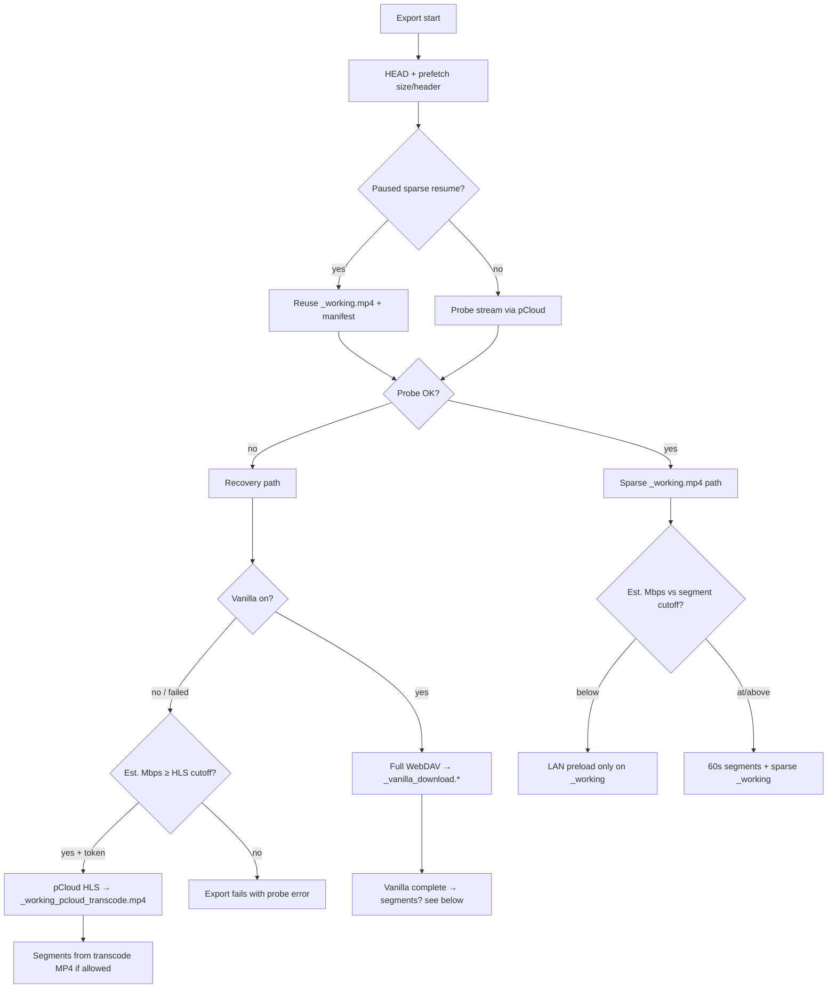

https://github.com/dsouzaankit/ios_3d_loop_segments/actions/workflows/ios-build.yml

cd P:\all_scripts\ios_3d_loop_segments\windows
Copy-Item loop-segments-windows.example.json loop-segments-windows.json   # once per PC
.\Set-LoopSegmentsWindows.ps1 -PhoneHost 10.0.100.10
.\Mount-LoopSegmentsRclone.ps1 -TestOnly   # optional LAN probe; PC rclone drive mount is optional/sluggish — see ../windows/archive/RCLONE-PHONE-MOUNT-LEGACY.md
# Skybox (Quest): Add WebDAV → http://<phone-ip>:8765/ (IP from Export screen) · admin / iosadmin — see “Quest LAN playback” below

Notes:
LAN: below Mbps cutoff → preload/full file only; at/above → op_*.mp4 when codec allows (LAN server optional).
_working.mp4 is streamable only when seek=0:00!
Av1 is not supported, prefer h.265!
phone must be unlocked, app in foreground, screen on:
  Optional: Settings > Display & Brightness > Auto-Lock > Never!


# Loop Segments (iOS)

**Cellular → pCloud WebDAV → segment export → LAN (or USB) → PC DLNA.** See [../WORKFLOW.md](../WORKFLOW.md).

Build **1.0.6+** uses **AVFoundation** stream copy to `op_00.mp4` / `op_01.mp4` (no embedded ffmpeg). Required on **iOS 26.x** (ffmpeg-kit crashes at launch).

## Open in Xcode (requires macOS or cloud CI)

**Option A — XcodeGen**

```bash
cd ios
brew install xcodegen   # on macOS
xcodegen generate
open LoopSegments.xcodeproj
```

No ffmpeg SPM dependency in [project.yml](project.yml).

**Option B — manual**

1. New iOS App (SwiftUI, iOS 17+).
2. Add all files under `LoopSegments/`.
3. Merge [LoopSegments/Resources/Info.plist](LoopSegments/Resources/Info.plist) keys.

## Export (AVFoundation)

- WebDAV: `WebDAVResourceLoader` + Basic auth on `AVURLAsset`
- Passthrough to MP4 when supported: H.264, HEVC (hvc1/hev1) + **AAC audio** when the source has aac/mp4a (manual path was video-only before build 133; export session kept both tracks)
- 60s segments when source is **at/above** the Mbps cutoff (and codec allows); phone alternates **`pcld_ios_media/loop/op_00.mp4`** / **`pcld_ios_media/loop/op_01.mp4`**; sparse in-progress copy **`pcld_ios_media/_working.mp4`**. Below cutoff: LAN preload to EOF only (no segments). **LAN:** **`http://<phone-ip>:8765/`** serves **HTTP** (files, index, Range) **and WebDAV** (PROPFIND / listings for Skybox, Windows clients). **Quest Skybox:** add **WebDAV** with **`admin` / `iosadmin`**. **PC:** browser / `Invoke-WebRequest` / **[`../windows/archive/Sync-FromPhoneLAN.ps1`](../windows/archive/Sync-FromPhoneLAN.ps1)**; optional **[`rclone`](../windows/archive/RCLONE-PHONE-MOUNT-LEGACY.md)** mount to a drive letter can feel **sluggish** — not required if Skybox talks to the phone directly. **Dense fill** per minute when segments run.
- **Recovery when sparse probe fails:** probes **via pCloud before** creating `_working.mp4` when not resuming a paused sparse export; abandons any stale sparse shell when vanilla/HLS starts; LAN hides `_working.mp4` while `_vanilla_download.*` is active. (1) **Vanilla WebDAV download** first if enabled (default on; **no API token** — works when `gethlslink` fails) → **`_vanilla_download.<ext>`**; MP4/MOV/M4V also **`_vanilla_faststart.mp4`**; (2) **pCloud HLS** only if vanilla is off or failed and estimated bitrate is above the **HLS cutoff** → **`_working_pcloud_transcode.mp4`**. Browser shows **WMV** and **TS** in the file list.
- Real-time read pacing (like ffmpeg `-re`); segments cut at **keyframes** (~60s target, not strict wall-clock grid)
- Runs until end of file, **Pause** (checkpoint + files kept), or **Stop** (clears paused state, removes `op_*.mp4`); **per-minute failsafe** skips a failed minute and continues dense-filling **`_working.mp4`**

Implementation: `LoopSegments/Services/Export/SegmentExporter.swift`

## PC sync (LAN — HTTP + WebDAV)

1. On the phone: **LAN server on Wi‑Fi** (export screen; app open on LAN).
2. **URLs:** **`http://<phone-ip>:8765/`** (from Export screen — best on **Windows**) or **`http://<iphone-name>.local:8765/`** (mDNS; same as **Settings → General → About → Name**). Bonjour advertises service **`loopsegments._http._tcp`**, not hostname `loopsegments.local`. HTML index, **`status.json`**, **GET**/**HEAD** with **Range**, plus **WebDAV** (PROPFIND, LOCK, etc.). While export runs, the index **polls `status.json` every 60s** to refresh WAN Mbps / fill stats (session metrics reset on each export start or resume).
3. **Skybox on Quest:** WebDAV root above, Basic auth **`admin` / `iosadmin`** (same as in code). **PC DLNA:** usually copy or sync into a local folder; mounting the phone with **`rclone`** is **optional** and often **slow** vs playing from Skybox or using direct HTTP links — see [`../windows/archive/RCLONE-PHONE-MOUNT-LEGACY.md`](../windows/archive/RCLONE-PHONE-MOUNT-LEGACY.md).

Unattended **pCloud → PC** (no phone LAN): **`Run-SegmentCopy.ps1`** in the sibling **`3d_loop_segments`** repo.

LAN serves **`pcld_ios_media/**`** automatically (all video extensions on disk — `op_*.mp4`, `_working*.mp4`, `_vanilla_*`, faststart copies, WMV/MKV, etc.). **Excluded:** `*.staging.*`, `*.sparse.json`, hidden/temp remux files. **`_vanilla_download.<ext>`** is listed and served **while the WebDAV download runs** (growing file); MP4/MOV/M4V also refresh **`_vanilla_faststart.mp4`** every 25% during download. Root **logs** (`export_latest.txt`, …) stay allowlisted; **`search_debug.txt`** and **`export_session_*`** are not served. Port **8765**. **Browser / Pigasus / Skybox WebDAV:** same tree; **`#t=`** on the index handles resume for `_working` (clears after a finished export).

**Windows / `.local`:** **`http://iphone.local:8765/` usually fails** — that hostname only exists if About → Name is literally “iPhone” (otherwise it is e.g. `http://johns-iphone.local:8765/`). Windows often does not resolve any `.local` name without [Apple Bonjour](https://support.apple.com/kb/DL999). Use the **LAN IP** from Export (`http://10.x.x.x:8765/`). Test: `cd windows` → `.\Set-LoopSegmentsLANHost.ps1 <ip>` → `.\Mount-LoopSegmentsRclone.ps1 -TestOnly`.

### `_working.mp4`: browser scrubber vs export logs

`_working.mp4` is **sparse**: the file size and MP4 index at EOF make the browser **scrubber show the full movie duration** (you can drag near the end) even when most of the middle is still empty. **Only dense byte spans** play on LAN — not the scrubber position alone. **Mbps cutoff** (Export UI, default ~29): at or below → **no** `op_*.mp4` (LAN preload on `_working.mp4` or vanilla download only). **At or above** → 60s segments to `loop/op_*.mp4` when codec allows — **LAN server can stay on** (`http://&lt;phone-ip&gt;:8765/`). High-bitrate segment mode uses minimal `_working` prefetch (export cursor only). Each dense fill pauses prefetch briefly. **Seek &gt; 0:** prefetch from the seek byte offset. Export logs and **`http://&lt;phone-ip&gt;:8765/`** show **`LAN playable till 12:34, exported 11:00, started 10:00`** (also in `status.json`).

Export logs with **`@ X Mbps`** mean a **pCloud** range read (dense fill or, for mid-file minutes, passthrough while the window is not dense yet). After a minute is dense on `_working.mp4`, the app uses **disk passthrough** for that segment (no second pCloud read for the same window). **Pause** keeps checkpoint + files; **Stop** clears paused state and removes published `op_*.mp4`.

### SMB vs HTTP / WebDAV on the phone

**True SMB** is not available. The app serves **HTTP + WebDAV** on **8765** (not a Windows file share). Mapped-drive / PROPFIND clients use **WebDAV**; browsers use **GET** on file URLs and the HTML index. Legacy **`net use`** notes and **PC rclone** script live under [`../windows/archive/`](../windows/archive/).

| File | HTTP/WebDAV URL | Skybox via PC DLNA |
|------|--------------------------------------|---------------------|
| `pcld_ios_media/loop/op_00.mp4`, `pcld_ios_media/loop/op_01.mp4` | Yes | Usually OK |
| `pcld_ios_media/_working.mp4` | Yes | May work (like VLC); sparse holes can break some servers |
| `pcld_ios_media/_working_pcloud_transcode.mp4` | Yes | HLS transcode in progress (not original WMV/MKV) |
| `pcld_ios_media/_vanilla_download.*` | Yes | Full dense copy (e.g. `.wmv`); **USB copy to PC** or full LAN GET when download complete (PotPlayer/VLC). iOS does not segment WMV. |
| `pcld_ios_media/_vanilla_faststart.mp4` | Yes | Faststart MP4 sidecar when vanilla backup ran on MP4 |

### Quest LAN playback (Skybox vs Pigasus)

**pCloud WebDAV in Skybox** = full **HTTPS** files on pCloud’s server (what already works for you).

**Phone LAN** (`http://<ip>:8765`) = **HTTP + WebDAV** (same export tree). Players differ:

| Player | `pcld_ios_media/_working.mp4` (sparse) | `pcld_ios_media/loop/op_00.mp4` (segment) |
|--------|----------------------------------------|------------------------|
| **Pigasus** (direct URL / network file) | **Works** — uses HTTP **Range** | Should work |
| **Skybox (WebDAV to phone)** | Often **works** for LAN export (app serves WebDAV + Basic auth) | **5K+ HEVC** may still show “too large to decode”; try segments or Pigasus |
| **Quest browser** (index link, `#t=`) | Works for dense-filled regions | Works (**build 173+** — skip broken faststart remux from 171–172) |

**In-progress export on Quest:** **Skybox** → Add WebDAV server → `http://<ip>:8765/` · **`admin` / `iosadmin`**, or **Pigasus** / browser with direct URLs.

### Skybox (Quest) and the phone LAN

**pCloud** in Skybox uses **pCloud WebDAV** (unchanged).

**Phone** in Skybox: add **WebDAV** with base URL **`http://<ip>:8765/`** and **`admin` / `iosadmin`**. That uses the app’s **LAN WebDAV** implementation (not plain SMB).

**Reliable paths:**

- **Full movie on pCloud** — pCloud WebDAV in Skybox.
- **Phone export** — Skybox WebDAV to the phone, **Pigasus** / browser HTTP URLs, or copy to a PC folder for DLNA.

**PC test:**

```powershell
cd windows
.\Set-LoopSegmentsLANHost.ps1 10.0.100.10
.\Mount-LoopSegmentsRclone.ps1 -TestOnly
```

Expect **GET** **`status.json`** and index **`/`** OK. **`rclone`** drive mapping is optional and may be **slow**; see [`../windows/archive/`](../windows/archive/).

### Download modes by scenario

Every export starts with **WebDAV HEAD + prefetch** (size + container header/index). The app then picks **one primary pipeline** and, within sparse/vanilla/HLS, **one transport per ~60s window**. Check `export_latest.txt` for the path that ran.

#### Settings that gate behavior

| Setting | Default | Effect |
|---------|---------|--------|
| **LAN server on Wi‑Fi** | On | `:8765` HTTP/WebDAV; enables `_working.mp4` sequential preload when export runs. Off → no background prefetch (on-demand dense fill per minute only). |
| **60s segments when at/above** | 29 Mbps | Below → **no** `op_*.mp4` (LAN preload and/or full vanilla only). At/above → try `op_00`/`op_01` when codec allows. |
| **Vanilla download first** | On | After sparse probe fails: full WebDAV copy before HLS. |
| **pCloud HLS if WebDAV fails above** | 2.5 Mbps (1×) | Minimum est. source bitrate for HLS fallback (`gethlslink`; needs API token). |

#### Primary pipeline (first branch)



| Scenario | When chosen | On-disk output | WAN download pattern |
|----------|-------------|----------------|----------------------|
| **Sparse `_working.mp4` (normal)** | pCloud probe succeeds (typical MP4/MOV/M4V/MKV with readable track) | Sparse shell + dense spans | Per-minute windows + optional LAN preload (see below) |
| **LAN preload only** | Sparse path + est. bitrate **below** segment Mbps cutoff | `_working.mp4` filled toward EOF | **8 parallel** WebDAV chunks, sequential from playback start (or 0→seek prefix when seek > 0) |
| **Sparse + 60s segments** | Sparse path + est. bitrate **at/above** cutoff + H.264/HEVC + AAC | `_working.mp4` + `loop/op_*.mp4` | One dense window per minute (+ minimal prefetch at export cursor when LAN on) |
| **Vanilla full download** | Sparse probe fails **or** resume probe fails; toggle **on** (default) | `_vanilla_download.<ext>` (+ `_vanilla_faststart.mp4` for MP4/MOV/M4V) | **2 MB** sequential WebDAV from byte 0; **resumes** partial via `_vanilla_download.meta.json` |
| **pCloud HLS transcode** | Vanilla off/failed; probe error is container/no-track; est. Mbps ≥ HLS cutoff; API token | `_working_pcloud_transcode.mp4` (growing MP4) | HTTPS HLS playlist + progressive transcode (not WebDAV range mirror) |
| **Probe failure (terminal)** | Recovery exhausted (vanilla off, HLS ineligible or failed) | None new | — |

**Recovery notes:** Fresh export probes pCloud **before** creating `_working.mp4` (avoids a useless sparse shell). Starting vanilla/HLS **removes** stale sparse `_working.mp4`. LAN hides `_working.mp4` while `_vanilla_download.*` is active.

#### Per-minute transport (sparse path, segments enabled)

After the primary pipeline is sparse + segments, each ~60s window uses **one** of these (in order tried):

| Mode | Scenario | Behavior |
|------|----------|----------|
| **Dense fill + local passthrough** | Minute at **seek 0**, or window already **dense** on `_working.mp4` | WebDAV fills that byte range → **`file://`** passthrough on temp → `op_*.mp4` |
| **Mid-file dense + `file://`** | Window dense after fill, byte offset **> 0** (incl. large HEVC after ~1 GB window fill) | Passthrough from disk on `_working.mp4` (no second pCloud read for that window) |
| **Dense fill + export session** | Full source dense on disk, **dense HEVC window ≥ ~256 MB**, or manual writer stall | `AVAssetExportSession` passthrough on temp (avoids manual writer backpressure on high-bitrate minutes) |
| **Remote capped hybrid** | Mid-file, window **not** dense, **above** segment cutoff, file **< ~1.5 GB** or non‑large‑HEVC | Capped pCloud reads (head + minute window + index) → hybrid reader → passthrough; falls back to HTTPS / export session |
| **Large HEVC mid-file** | **≥ ~1.5 GB** file, HEVC, minute **not** at byte 0 | Dense-fill window → **`AVAssetExportSession`** when window **≥ ~256 MB** (proactive; skips manual writer stall) |
| **Below cutoff mid-file** | Same as hybrid but **LAN preload to EOF** is active | Prefer **dense fill on `_working.mp4`** first (no remote passthrough) so LAN contiguous playback grows |
| **Minute failsafe** | Passthrough error on one minute | Log, **skip** minute, continue dense-filling `_working.mp4` |

**Timeline mapping:** Byte ranges use reported duration; if index duration differs, logs show both. Keyframe-aligned boundaries when enabled (~60s target, not strict wall-clock grid).

#### After vanilla download completes

| Scenario | Then |
|----------|------|
| **WMV/ASF, MKV, AVI, …** (`supportsIOSegmentExport` false) | Stops after full file on disk — play **`_vanilla_download.*`** on PC/LAN; **no** `op_*.mp4` on phone |
| **MP4/MOV/M4V, est. Mbps below cutoff** | Full file kept; **no** segments (`finishVanillaWithout60sSegments`) |
| **MP4/MOV/M4V, at/above cutoff, H.264/HEVC + AAC** | ~60s segments from **local** copy (`_vanilla_download.*` or `_vanilla_faststart.mp4` if built) |
| **AV1 or unsupported codec** | Vanilla file kept; segment export fails with codec message |
| **Probe fails on completed vanilla** | File kept for LAN/USB; no segments |

#### After pCloud HLS transcode

| Scenario | Then |
|----------|------|
| **Est. Mbps below segment cutoff** | Transcode MP4 grows on disk for LAN; **no** `op_*.mp4` |
| **At/above cutoff** | Segments cut from **`_working_pcloud_transcode.mp4`** as it grows (same minute loop as sparse) |

#### LAN serving vs download (not a download mode)

| File | Served while… | Range / seek |
|------|---------------|--------------|
| `_working.mp4` | Sparse export or preload | Contiguous dense bytes only; **32 MB cap** on sparse in-progress responses (Quest OOM) |
| `_vanilla_download.*` | Vanilla download or complete | Full file Range/seek when dense/complete (**no** 32 MB cap) |
| `_working_pcloud_transcode.mp4` | HLS transcode export | Growing MP4 |
| `loop/op_*.mp4` | After publish | Full segment files |

#### Codec / container gates (segment export)

| Source | Sparse probe | 60s `op_*.mp4` |
|--------|--------------|----------------|
| **MP4/MOV/M4V** H.264/HEVC + AAC | Usually yes | Yes (if Mbps cutoff met) |
| **AV1** | May probe | **No** — re-encode source |
| **WMV/ASF** | Usually fails → vanilla | **No** on device |
| **MKV/WebM/AVI/TS** | Often fails or no sparse MP4 shell | **No** unless vanilla MP4 + codec OK |

#### Disk / size thresholds (code constants)

| Threshold | Value | Effect |
|-----------|-------|--------|
| **Large file** | ~**1.5 GB** | Sparse temp only (not full copy); large HEVC mid-file uses dense-window export session |
| **Mid-file byte offset** | **> 32 MB** | Treated as mid-file for prefetch / remote passthrough decisions |
| **LAN preload disk budget** | ~**700 MB** working set (+ margin) when segments run | Below-cutoff preload may require space for **full file** |
| **Vanilla** | **Entire** source file (+ faststart sidecar for MP4) | Must fit on device |

#### How to read logs

- **`@ X Mbps`** on a line → pCloud WebDAV range read (dense fill or capped hybrid).
- **`Vanilla download`** → sequential 2 MB chunks; retries in log when cellular drops.
- **`LAN preload only`** → below Mbps cutoff; no `op_*.mp4`.
- **`LAN playable till`** on `:8765` → furthest contiguous playable timeline; vanilla uses download % × duration (estimated/probed during download).

### Faststart remux (on phone)

**Faststart** = MP4 with **`moov` at the file head** (network-friendly layout) via `AVAssetExportSession` passthrough + `shouldOptimizeForNetworkUse` — **no re-encode**, container rearrange only (`MP4NetworkOptimize.swift`).

| Output | When |
|--------|------|
| **`loop/op_00.mp4`**, **`op_01.mp4`** | After each segment is written, if `moov` is still at EOF (Skybox / LAN players) |
| **`_vanilla_faststart.mp4`** | Only if **`_vanilla_download.mp4`** has moov-at-end; skipped when download already faststart |

**Pre-faststarting files on pCloud** (ffmpeg before upload) is optional for “play full movie from pCloud WebDAV”; it does **not** fix WMV probe failures, doubles handling if you remux after upload, and invalidates in-progress sparse resume if you replace the cloud object. The app keeps cloud originals untouched.

**Windows batch faststart (separate from this app):** `P:\all_scripts\faststart` — `Apply-Faststart.ps1` / `run_faststart.cmd` remuxes MP4/MOV/M4V on disk (paths in `faststart-paths.txt`; files **> 2 GB** use local temp then upload). Log cleanup: `Truncate-FaststartLogs.ps1` / `truncate_logs.cmd` (archive logs **> 5 MB**, prune old `ffmpeg-*.err`). Not part of the iOS export pipeline.

### Export screen settings (LAN section)

Same toggles as **Settings that gate behavior** (above). The HLS control is **0.25× / 0.5× / 1× / 2× / 4×** of the **2.5 Mbps** base (`PCloudHLSLink.transcodeMinSourceMbps`).

## Photos library (deactivated in app)

The Photos import sub-workflow is **off** (`PhotosSegmentPublisher.workflowEnabled = false` in source). Re-enable there to restore the export UI and library sync.

## Search: `tokenSaved=false` / no API token

WebDAV browse and export work without the REST token. **Search** needs `userinfo?getauth=1` to return an `auth` field.

If `search_debug.txt` shows `result=0 but no auth` with your `userid`, pCloud recognized the account but **did not issue a search token**. Common causes:

| Check | Action |
|-------|--------|
| Wrong datacenter | Sign out → match **US** vs **Europe** to [my.pCloud](https://my.pcloud.com) (Settings → Data regions) |
| **2FA enabled** | pCloud often blocks third-party API tokens while WebDAV still works — try signing in after disabling 2FA, or an app-specific password if your account has one under Security |
| Stale API session | Build **88+** uses a cookieless login session; sign out and sign in again |
| Timeout | Search prepare allows **45s** for token fetch across regional API hosts |

Export and folder browse use **WebDAV only** — you do not need search for those.

## No Mac on your desk

[BUILD-WITHOUT-MAC.md](BUILD-WITHOUT-MAC.md) — GitHub Actions / Codemagic.

## Windows sync (LAN → DLNA)

**`Documents/Exports/pcld_ios_media/loop/op_00.mp4` (and `op_01`) are the rotating segment sources; `pcld_ios_media/_working.mp4` is the sparse working copy.**

| Step | PowerShell / action |
|------|------------------------|
| Phone **Exports** → PC | **`http://<ip>:8765/`** in a browser, **`Invoke-WebRequest`**, USB, or **[`../windows/archive/Sync-FromPhoneLAN.ps1`](../windows/archive/Sync-FromPhoneLAN.ps1)**; optional **`../windows/Mount-LoopSegmentsRclone.ps1 -TestOnly`** |
| Manual USB | **Apple Devices** → Loop Segments → Exports → Save to PC |
| rclone+WinFsp mount on PC (optional; can be sluggish) | **[`../windows/archive/RCLONE-PHONE-MOUNT-LEGACY.md`](../windows/archive/RCLONE-PHONE-MOUNT-LEGACY.md)** — Skybox WebDAV to the phone does not need this |

```powershell
cd ..\windows
.\Set-LoopSegmentsLANHost.ps1 192.168.1.42
.\Mount-LoopSegmentsRclone.ps1 -TestOnly
# Copy files from the LAN index or use archive\Sync-FromPhoneLAN.ps1 — see WORKFLOW.md
```

Details: [../WORKFLOW.md](../WORKFLOW.md) §3, [../FEASIBILITY.md](../FEASIBILITY.md).
